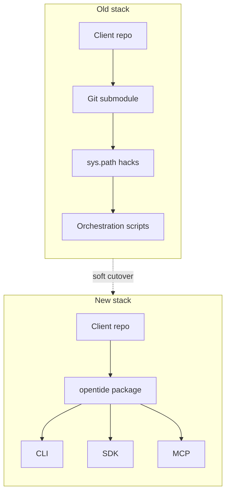
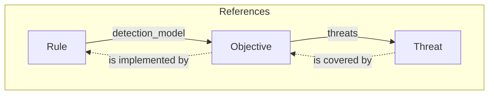

We spent a long time running DetectionOps as a git submodule. That era is over. The engine is a package now — CLI, MCP, SDK, same object graph — and we are making that the default.

Not a hard cut. If you already have a pinned checkout of the old engine, it keeps working. We are not going to break your git history to prove a point. New work, though, does not go into the archived tree.

<CutoverTimeline />

## Why we did this

Detection-as-code does not fail because KQL is hard. It fails when the engine you share cannot be versioned, reviewed, or handed to an agent without a small ritual.

The old engine lived inside client repositories as a submodule. Getting it on `sys.path` took a git walk. The entry point was a fifteen-hundred-line file that loaded the catalogue on import. Object names hid the domain — MDR, TVM, DataTide — so a new engineer learned our plumbing before they learned their threats. Schemas existed in three places at once: YAML metaschemas, Python dataclasses, and the loaders that tried to keep them honest. They drifted. Vocabularies were untyped. A couple of generators duplicated their own enum descriptions and nobody noticed until a schema diff looked like a fight.

Upgrades were someone else's git history. You could not pin `opentide==0.4` and move on. You pinned a SHA, prayed the next pull did not rewrite `Orchestration/`, and wrote the same CI glue in every instance.

Agents made that worse. A model that edits detection YAML needs a schema, an honest capability report, and an exit code that means something. Seven platforms deploy. Five of them can validate query syntax. CrowdStrike and HarfangLab cannot — and we will say so rather than return a fake pass.

So we rebuilt the engine as a package, in a new repository, instead of renovating the submodule in place. The old tree stays a historical artefact. The new one never inherited the `sys.path` tricks.



<Tabs items={['Before', 'After']}>

<Tab value="Before">

```python
import sys, git
sys.path.append(str(git.Repo(".", search_parent_directories=True).working_dir))
from Engines.modules.tide import DataTide
from Engines.modules.plugins import DeployTide

rule = DataTide.Models.mdr[uuid]
DeployTide.mdr["sentinel"].deploy(...)
```

```bash
python Orchestration/validate.py
```

</Tab>

<Tab value="After">

```python
from opentide import OpenTide

OpenTide.initialise()
rule = OpenTide.Rules[uuid]
rule.deploy("sentinel")
```

```bash
opentide validate --strict
opentide deploy --platform sentinel --dry-run
```

</Tab>

</Tabs>

## What you get now

Four things changed in practice. The rest is documentation.

You **pin a version**, not a submodule SHA. Until the PyPI cut lands in this window, install from the [opentide](https://github.com/OpenTideHQ/opentide) repository the same way you will from the index later.

You get **one surface**. `opentide validate`, `generate`, `deploy`, `setup`. `from opentide import OpenTide`. `opentide-mcp` for agents. The CLI orchestrates; the registry does not pretend to.

**Specs live on their own.** JSON Schema is generated from the models. It is an artefact, not the contract. That is what stops the triple-maintenance we had before.

**Content and the engine are no longer the same repo trick.** Public objects sit in the Library. Explorer is how you walk them. Skills are how agents author against the same graph.

<div className="not-prose">
  <PipelineFlow />
</div>

The object model did not change in spirit. A threat is still what you defend against, an objective is still what you are trying to detect, a rule is still how you detect it on a platform. References still point rule → objective → threat. Coverage still flows the other way. The names are just English now.



<Callout type="info">
Seven platforms deploy. Five validate query syntax — Sentinel, Defender, Splunk, SentinelOne, Carbon Black. CrowdStrike and HarfangLab are deploy-only. The CLI and MCP report `supported: false` there. They do not invent a pass.
</Callout>

## Soft rollout

We are archiving the old engine and companion repos. History stays. Issues stay. The READMEs will point here. That is the public signal that new work happens on the new stack.

Pinned submodules continue to resolve against the commit you already have. Existing production instances do not have to move this week. They should move when they next touch CI — not in a panic, and not by rewriting history.

There is no magic `opentide migrate`. The [migration guide](/docs/usage/migration/) is the path: drop the submodule, replace `Orchestration/` with the CLI, set `OPENTIDE_REPO_ROOT`, run `opentide validate --strict`. If you would rather have an agent do the mechanical edits, there is a prompt on that page. Review the diff as if a colleague wrote it.

<Steps>

<Step>

### Archive

The old engine and companion repos go read-only. Bookmarks, SHAs, and clones you already have are unaffected.

</Step>

<Step>

### Migrate when you next touch CI

Remove the submodule. Depend on the package. Swap `python Orchestration/validate.py` for `opentide validate --strict`. Keep `--platform`; do not bring back `--system`.

</Step>

<Step>

### Sit for four weeks

We will treat this as a freeze on ambition: deployer bugs, docs, agent setup, migration questions. After that we can talk about what 1.0 even means.

</Step>

</Steps>

## Four weeks

This is the part of a rewrite people skip. The package works. The docs are in better shape than they have ever been. That is not the same as “we are done.”

For four weeks we are not adding platforms, not inventing lint commands, not shipping a language server. We will fix what you hit: validation that is too loud or too quiet, a deployer that misbehaves on a tenant you actually have, a setup wizard that writes the wrong MCP path, a migration step the guide forgot.

<Callout type="warn">
If something is wrong, file it on [OpenTideHQ/opentide](https://github.com/OpenTideHQ/opentide/issues). That is the engine now. The archived tree will not grow new fixes.
</Callout>

The old engine earned the rewrite. It ran in production for years before it was open-sourced; it taught us what DetectionOps actually needs. The work was to make that practice installable, reviewable, and honest about what each platform can do.

Then we stop talking, and we sit with it.

<Cards>
  <Card title="Usage" href="/docs/usage/" description="Install, object model, and the detection-as-code loop." />
  <Card title="Migration" href="/docs/usage/migration/" description="Submodule to package — imports, CI, and the agent prompt." />
  <Card title="MCP" href="/docs/mcp/installation/" description="Wire Cursor, VS Code, or any MCP client to the same engine." />
</Cards>
