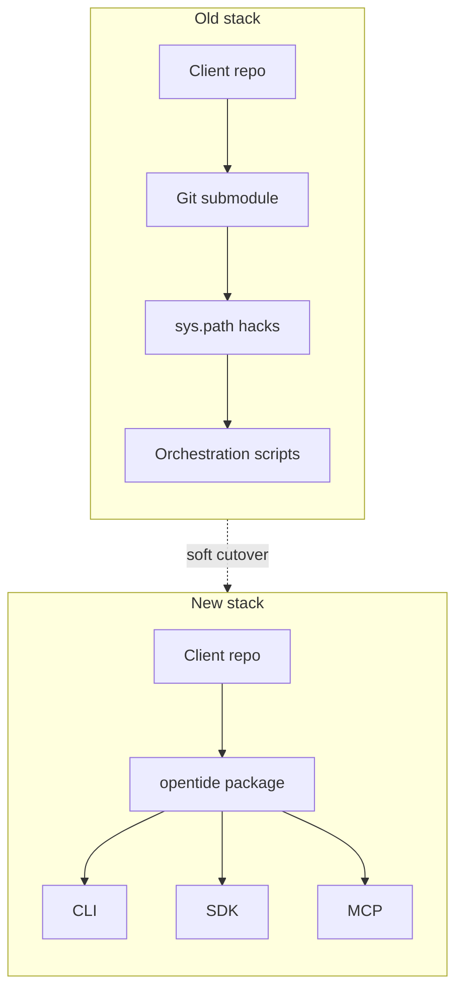
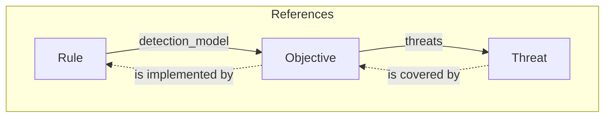

The engine used to ship as a git submodule. It is a PyPI package now — `pip install opentide` — CLI, MCP, and SDK on the same object graph. That is the default for new work.

Not a hard cut. If you already have a pinned checkout of the old engine, it keeps working. We are not going to break your git history to prove a point. New work does not go into the archived tree.

<CutoverTimeline />

## Why we did this

You can already write detections for Sentinel, Splunk, Defender, SentinelOne, Carbon Black, CrowdStrike, and HarfangLab. What kept breaking was the shared engine: it was not a version you could pin, not a reviewable upgrade, and every instance rewrote the same CI glue.

The old engine lived in the client repo as a submodule. Imports walked git to find `sys.path`. You pinned a SHA, hoped the next pull left `Orchestration/` alone, and could not write `opentide==0.4` and go home.

Schemas lived in three places — YAML metaschemas, Python dataclasses, and the loaders that tried to keep them aligned. They drifted. Vocabularies were untyped. A couple of generators even duplicated their own enum descriptions.

CI needs three things from an engine: a schema that matches the objects, a capability report that is true, and an exit code you can gate on. So we rebuilt it as a package, in a new repository, instead of renovating the submodule in place. The old tree stays as history. The new one never inherited the `sys.path` tricks.



<Tabs items={['Before', 'After']}>

<Tab value="Before">

```python
import sys, git
sys.path.append(str(git.Repo(".", search_parent_directories=True).working_dir))
from Engines.modules.tide import DataTide
from Engines.modules.plugins import DeployTide

rule = DataTide.Models.mdr[uuid]
DeployTide.mdr["sentinel"].deploy(...)
```

```bash
python Orchestration/validate.py
```

</Tab>

<Tab value="After">

```python
from opentide import OpenTide

OpenTide.initialise()
rule = OpenTide.Rules[uuid]
rule.deploy("sentinel")
```

```bash
pip install opentide
opentide validate --strict
opentide deploy --platform sentinel --dry-run
```

</Tab>

</Tabs>

## What you get now

You pin a version, not a submodule SHA. `pip install opentide`, then lock it like any other dependency.

CLI, SDK, and MCP are the same package — `opentide validate`, `from opentide import OpenTide`, `opentide-mcp`. Not three engines, and not a pile of `Orchestration/` scripts.

JSON Schema is generated from the models, so the types and the schema cannot drift. Models are the source of truth; the schema is what CI and editors actually consume. Detection content stays in your repo. That split is the point of a dependency.

<div className="not-prose">
  <PipelineFlow />
</div>

The object model did not change in spirit. A threat is still what you defend against, an objective is still what you are trying to detect, a rule is still how you detect it on a platform. References still point rule → objective → threat. Coverage still flows the other way.



<Callout type="info">
Seven platforms deploy. Five validate query syntax — KQL, SPL, S1QL, Lucene. CrowdStrike and HarfangLab cannot. The CLI and MCP report `supported: false` there instead of inventing a pass.
</Callout>

## Soft rollout

We are archiving the old engine and companion repos. History stays. Issues stay. The READMEs will point here. New work goes in the package.

Pinned submodule SHAs and existing clones keep working. Existing production instances do not have to move this week. They should move when they next touch CI — not in a panic, and not by rewriting history.

There is no magic `opentide migrate`. The [migration guide](/docs/usage/migration/) is the path: drop the submodule, replace `Orchestration/` with the CLI, set `OPENTIDE_REPO_ROOT`, run `opentide validate --strict`. If you would rather have someone else do the mechanical edits, there is a prompt on that page. Review the diff as if a colleague wrote it.

<Steps>

<Step>

### Archive

The old engine and companion repos go read-only. SHAs and clones you already have are unaffected.

</Step>

<Step>

### Migrate when you next touch CI

Remove the submodule. `pip install opentide`. Swap `python Orchestration/validate.py` for `opentide validate --strict`. Keep `--platform`; do not bring back `--system`.

</Step>

<Step>

### Four weeks of support

We are not adding platforms in this stretch. We will fix deployer bugs, docs, setup, and migration questions. After that we can talk about 1.0.

</Step>

</Steps>

## Four weeks

The package works. The docs are in better shape than they have ever been. For four weeks we are not adding platforms. We will fix what you hit: validation that is too loud or too quiet, a deployer that misbehaves on a tenant you actually have, a setup wizard that writes the wrong MCP path, a migration step the guide forgot.

<Callout type="warn">
If something is wrong, file it on [OpenTideHQ/opentide](https://github.com/OpenTideHQ/opentide/issues). That is the engine now. The archived tree will not grow new fixes.
</Callout>

The old engine ran in production for years before it was open-sourced. The work was to make that practice installable, and to stop lying about platforms that cannot validate a query. Then we take four weeks of bug reports.

<Cards>
  <Card title="Usage" href="/docs/usage/" description="Install, object model, and the detection-as-code loop." />
  <Card title="Migration" href="/docs/usage/migration/" description="Submodule to package — imports, CI, and the copy-paste prompt." />
  <Card title="MCP" href="/docs/mcp/installation/" description="Same engine, from an editor or an MCP client." />
</Cards>
