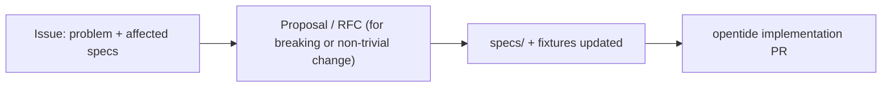

# Governance

The specifications are the **normative source** for OpenTide. This page explains who controls them, how they change, and why the model is built this way. It is written for anyone reading the specs; the repository mechanics contributors need live in the [specifications repository](https://github.com/OpenTideHQ/specifications).

## Why specifications exist

OpenTide previously mixed architecture notes, Python models, and generated JSON Schema with no single normative source, so authors, agents, and implementers had no clear precedence order. The specifications repository fixes that: it is a language-neutral, agent-friendly contract that evolves through a lightweight, transparent process.

## Authority model

```
spec markdown (here)  →  validation models (opentide)  →  JSON Schema (generated artifact)
vocabulary TOML (here) →  vocabulary bundle (opentide build)
```

Specs win on conflict. Generated JSON Schema is for editor and router validation — never for authoring normative changes. How to read the requirement keywords (MUST/SHOULD/MAY) is defined in [Conformance](conformance.md).

| Layer | Role | Source of truth? |
|-------|------|:---------------:|
| Spec markdown | Requirements and field semantics | Yes |
| Vocabulary TOML | Canonical allowed values | Yes |
| Validation models (opentide) | Runtime validation | No — implements specs |
| JSON Schema | Editor / router validation | No — generated |

## How specifications change



1. **Raise an issue** describing the problem, the affected specs, and acceptance criteria.
2. **Write a proposal** for non-trivial or breaking changes (an RFC). Maintainers accept or reject it; breaking changes must reference an accepted proposal.
3. **Update the specs** — the affected spec files, conformance fixtures, and the [spec index](SPECS.md). Bump each spec's `version` in frontmatter; a breaking object change gets a new spec file (e.g. `rule-1.1.md`) and the old file is marked `deprecated`, never deleted.
4. **Implement** in a separate opentide PR that aligns the validation models, generation, and tests.

Contributors: issue and PR templates, the RFC template, and CI live in the [specifications repository](https://github.com/OpenTideHQ/specifications) under `.github/` and `rfcs/`.

## Versioning rules

- No repository-wide version (there is no "specifications v1.0").
- Each spec file carries its own `version` in frontmatter.
- Object schema revisions use `metadata.schema` (e.g. `rule::1.0`) and map to `specs/objects/rule-1.0.md`.
- Object instance content uses semver in `metadata.version`; git is the authoritative history.

See [Versioning](specs/versioning.md) for the full contract, including how multiple revisions coexist.

## Design rationale

Why this shape, and not the obvious alternatives:

- **JSON Schema as the source of truth** — rejected: poor authoring ergonomics and hard to diff intent.
- **Python (Pydantic) models as the source of truth** — rejected: couples normative definitions to one implementation language.
- **A single monorepo** — deferred: a separate specifications repository keeps the contract language-neutral and agent-friendly.

Open questions the maintainers are still working through include automated drift detection between spec field tables and implementation models, and a bulk object-migration path. These are tracked as issues, not settled here.

## What belongs where

| In the specifications | Elsewhere |
|-----------------------|-----------|
| Normative specs (`specs/`) | CLI/SDK how-to guides ([Usage](/docs/usage/)) |
| Canonical vocabularies | Generated `.opentide/schemas/` |
| Conformance fixtures | Detection content itself |
| Governance and proposals | The published website build |
