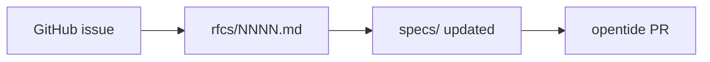

# Governance

## Purpose

This repository is the **normative source** for OpenTide specifications. The [opentide](https://github.com/OpenTideHQ/opentide) implementation follows these specs; it does not define them.

## Authority model

```
spec markdown (here) → Pydantic models (opentide) → JSON Schema (generated artifact)
vocabulary TOML (here) → vocabulary bundle (opentide build)
```

Specs win on conflict. Generated JSON Schema is for IDE validation and tooling — not for authoring normative changes.

## Change process



1. **Issue** — Open a spec-change issue describing the problem, affected specs, and acceptance criteria. Use the [spec-change issue template](https://github.com/OpenTideHQ/specifications/blob/main/.github/ISSUE_TEMPLATE/spec-change.yml).
2. **RFC** — For non-trivial or breaking changes, draft an RFC under `rfcs/`. Number sequentially (`0002`, `0003`, …). Use the [publish-rfc skill](https://github.com/OpenTideHQ/opentide/blob/development/.agents/skills/publish-rfc/SKILL.md) or write manually from [0000-template.md](rfcs/0000-template.md).
3. **Review** — Maintainers accept or reject the RFC. Breaking changes MUST reference an accepted RFC in the PR.
4. **Spec merge** — Update affected spec files, fixtures, `SPECS.md`, and `CHANGELOG.md`. Bump per-spec `version` in frontmatter; breaking object changes get a new file (e.g. `rule-1.1.md`) with the old file marked `deprecated`.
5. **Implementation** — A separate PR in opentide aligns Pydantic models, generation, and tests. Spec and implementation PRs may proceed in parallel after RFC acceptance but spec changes merge first for breaking work.

## What belongs here

| In scope | Out of scope |
|----------|--------------|
| Normative markdown under `specs/` | CLI how-to guides (opentide Docs) |
| Canonical `vocabularies/*.vocab.toml` | Generated `.opentide/schemas/` |
| Conformance `fixtures/` | Detection content corpus |
| RFCs and governance | Website build (Nextra, MkDocs, GitHub Pages) |

## Versioning rules

- No repository-wide semver (no "specifications v1.0").
- Each spec file has its own `version:` in frontmatter.
- Object schema revisions use `metadata.schema` (`rule::1.0`) and map to `specs/objects/rule-1.0.md`.
- Instance content versions use semver in `metadata.version`.

## Roles

- **Spec authors** — Propose changes via issue + RFC.
- **Maintainers** — Accept RFCs, merge spec PRs, ensure fixtures and index stay current.
- **Implementers** — Update opentide after spec merges; vocabulary sync is an opentide build concern.

## CI

Pull requests run [`.github/workflows/ci.yml`](https://github.com/OpenTideHQ/specifications/blob/main/.github/workflows/ci.yml):

- Validate all `vocabularies/*.vocab.toml` against `schemas/vocabulary.schema.json`
- Confirm required conformance fixtures exist

Run locally: `python3 -m venv .venv && .venv/bin/pip install jsonschema && .venv/bin/python scripts/validate.py`
