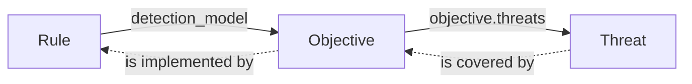
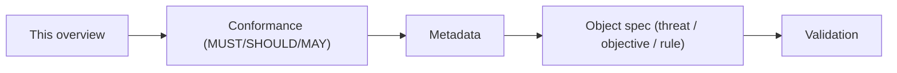

# OpenTide Specifications

These are the **normative specifications** for OpenTide — the contract that every detection object, tool, and agent relies on. The [opentide](https://github.com/OpenTideHQ/opentide) package implements this contract; the generated JSON Schema is a build artifact, never the source of truth. Each spec is versioned independently — there is no framework-wide version.

<Callout type="info">
Writing detections rather than the spec? Start with [Usage → Object model](/docs/usage/concepts/object-model/) for the hands-on view. These pages are the precise, normative reference behind it.
</Callout>

## What is a Tide object?

Detection content in OpenTide is a small graph of typed **objects**, each a YAML file with a shared `metadata` block. Three families exist:

| Family | Schema | Answers | Spec |
|--------|--------|---------|------|
| **Threat** | `threat::1.0` | What do we defend against? | [threat-1.0](specs/objects/threat-1.0.md) |
| **Objective** | `objective::1.0` | What are we trying to detect? | [objective-1.0](specs/objects/objective-1.0.md) |
| **Rule** | `rule::1.0` | How do we detect it, on which platform? | [rule-1.0](specs/objects/rule-1.0.md) |

### How objects chain

Objects reference each other by UUID. **References** point from rule to objective to threat; detection **coverage** flows the other way.

### Two version fields

Every object declares both, and they are independent:

- `metadata.schema` (e.g. `rule::1.0`) — the **structural revision**, selecting the validation model. See [versioning](specs/versioning.md).
- `metadata.version` (e.g. `1.2.0`) — the **instance content version**; git is the authoritative history.

## Where things live

| Artifact | Location |
|----------|----------|
| Normative specs | this section, `specs/` |
| Conformance fixtures (valid/invalid YAML) | [`fixtures/`](https://github.com/OpenTideHQ/specifications/tree/main/fixtures) |
| Canonical vocabularies (allowed values) | [`vocabularies/`](https://github.com/OpenTideHQ/specifications/tree/main/vocabularies) |
| Implementation | [opentide](https://github.com/OpenTideHQ/opentide) Python package |

## Reading order

1. **[Conformance](conformance.md)** — how to read the normative keywords.
2. **[Metadata](specs/metadata.md)** — the block every object shares.
3. **The object spec** you care about — [threat](specs/objects/threat-1.0.md), [objective](specs/objects/objective-1.0.md), or [rule](specs/objects/rule-1.0.md).
4. **[Validation](specs/validation.md)** — what the engine checks and when.

## Full index

The [spec index](SPECS.md) lists every active spec, its version, and status. Core infrastructure specs cover [workspace layout](specs/workspace.md), [configuration](specs/configuration.md), [deployment](specs/deployment.md), [platforms](specs/platforms.md), [metaschema keywords](specs/metaschema-keywords.md), and [vocabularies](specs/vocabularies/format.md).

Changes follow the process in [Governance](GOVERNANCE.md).
