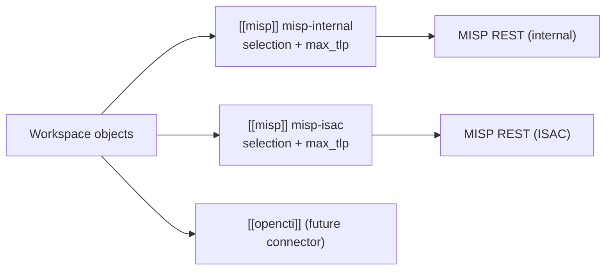
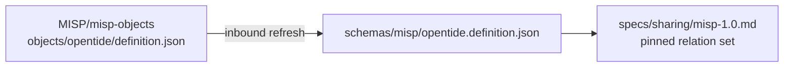

<RfcBanner entry={"{\"number\":\"0005\",\"status\":\"accepted\",\"note\":null,\"fields\":[{\"label\":\"Author\",\"parts\":[{\"kind\":\"text\",\"text\":\"Amine Besson\"}]},{\"label\":\"Created\",\"parts\":[{\"kind\":\"text\",\"text\":\"2026-09-15\"}]},{\"label\":\"Revised\",\"parts\":[{\"kind\":\"text\",\"text\":\"2026-09-28 — [[misp]] integration blocks in one sharing.toml; minimal MISP key set; pinned opentide template version 5 (see \"},{\"kind\":\"link\",\"text\":\"Revision history\",\"href\":\"#revision-history\"},{\"kind\":\"text\",\"text\":\")\"}]},{\"label\":\"Accepted\",\"parts\":[{\"kind\":\"text\",\"text\":\"2026-09-28 — normative text in \"},{\"kind\":\"link\",\"text\":\"specs/sharing.md\",\"href\":\"/docs/specifications/specs/sharing/\"},{\"kind\":\"text\",\"text\":\" and \"},{\"kind\":\"link\",\"text\":\"specs/sharing/misp-1.0.md\",\"href\":\"/docs/specifications/specs/sharing/misp-1.0/\"}]},{\"label\":\"Issue\",\"parts\":[{\"kind\":\"link\",\"text\":\"#10\",\"href\":\"https://github.com/OpenTideHQ/specifications/issues/10\"}]},{\"label\":\"PR\",\"parts\":[{\"kind\":\"link\",\"text\":\"#9\",\"href\":\"https://github.com/OpenTideHQ/specifications/pull/9\"},{\"kind\":\"text\",\"text\":\"; acceptance and normative specs in \"},{\"kind\":\"link\",\"text\":\"#19\",\"href\":\"https://github.com/OpenTideHQ/specifications/pull/19\"}]}]}"} />

> Numbering note: [issue #8](https://github.com/OpenTideHQ/specifications/issues/8) reserved **RFC 0004** for the Sysdig Falco deployer. That RFC file is not in this repository yet. This proposal takes **0005** to avoid colliding with that reservation.

## Summary

Add a first-class **sharing** subsystem to opentide: pluggable connectors, one workspace file `sharing.toml` in which every destination is a block under its integration (`[[misp]]`, later `[[opencti]]`) carrying its own selection and TLP ceiling, and a CLI family `opentide share` that publishes Tide objects (threat, objective, rule) to external intelligence platforms. Sharing is **not** detection-platform deployment — `opentide deploy` remains the path to SIEMs and EDRs. The first connector is **MISP**.

The MISP connector is a **document transport**, not a field mapper. One MISP Event carries one Tide object, and that Event carries exactly one instance of the upstream [`opentide`](https://github.com/MISP/misp-objects/tree/main/objects/opentide) MISP object, whose `opentide-object` attribute holds the object document verbatim — comments, key order, and formatting preserved. Nothing is removed from that document. Exposure is decided by the block's TLP ceiling and the MISP `distribution` that the object's `metadata.tlp` value maps to; it is never decided by filtering fields out of the payload. Tagging is restricted to TLP, PAP, and galaxy clusters from two galaxies (`threat-actor` and `mitre-attack-pattern`). Event identity belongs to the receiving instance: the Event UUID is MISP-assigned, and the connector finds an existing Event by a composite key — creator organisation plus the object UUID carried in the `opentide` object — so several organisations can publish their own version of the same opentide object without colliding.

This RFC is additive with respect to the object model. It does not revise `threat::1.0`, `objective::1.0`, or `rule::1.0`, and it adds or modifies no file under `specs/objects/` or `schemas/pins/`. After acceptance, follow-up PRs add `specs/sharing.md`, `specs/sharing/misp-1.0.md`, an additive `specs/metadata.md` `1.1` revision carrying an optional `metadata.pap` field, the pinned upstream template copy, and conformance fixtures. opentide implements the CLI and connector in a separate repository.

## Motivation

Detection-engineering teams already keep ATT&CK-mapped threats, objectives, and rules in an opentide workspace, with TLP on every object. They still copy that content into MISP by hand — or do not share it at all — because opentide can **deploy** a rule to Sentinel but cannot **publish** the surrounding detection knowledge to a CTI community.

Stakeholders:

- **Detection engineers** need a repeatable, TLP-aware `opentide share` whose output is predictable: what was authored is what is published.
- **CTI / ISAC operators** need MISP Events that round-trip opentide identity so communities can consume detections as intelligence and hand them back into a workspace, not as a lossy summary.
- **Implementers (opentide)** need a connector contract analogous to [platforms.md](/docs/specifications/specs/platforms/): capability matrix, TOML shape, honest failure modes, idempotent upsert.
- **Workspace maintainers** need to publish to more than one MISP instance — an internal instance and a sector ISAC, say — with per-instance credentials, per-instance policy, and no forked configuration.

Two things changed since the first draft of this RFC, and both point away from field decomposition.

**A document is the useful unit.** The first draft decomposed every object into MISP `detection` object attributes, event-level typed attributes, and a wide taxonomy tag set. That mapping is lossy in one direction and unfaithful in the other: opentide fields that no MISP template models (TVM `terrain`, `leverage`, `viability`, chaining; signal composition) had to become untyped `text` attributes with comments, while required template attributes opentide cannot fill needed placeholders. A consumer could not reconstruct the object, and an implementer had to re-derive dozens of per-family rules. Carrying the document itself makes consumption a single parse and makes a future inbound path (`share pull`) tractable rather than speculative. Upstream MISP now ships an `opentide` object template built for exactly this, which removes the earlier objection that document transport would require every receiving instance to install a custom template first.

**Filtering the payload was the wrong control.** The first draft carried five `include_*` switches plus a redacted-YAML attachment option, each deciding whether queries, internal references, tenants, or platform blocks were emitted. That is a second, weaker access-control system sitting beside the one opentide already has. TLP is on every object; MISP distribution and sharing groups already express reach. Deciding exposure twice — once by TLP and once by a per-field switch — produces objects that are neither faithful nor safe, and it makes conformance unverifiable because the emitted shape depends on flag combinations. This revision keeps one control surface: the object's TLP, checked against each block's ceiling and mapped to a MISP distribution.

Without a spec, each workspace would invent its own export script, TLP handling would drift, and a later OpenCTI or TAXII connector would not share a CLI or config model.

## Detailed design

### Revision history

| Date | Change |
|------|--------|
| 2026-09-15 | Initial proposal: sharing subsystem, MISP connector with per-family field decomposition into MISP `detection` objects, broad taxonomy tagging, and `include_*` payload filtering. |
| 2026-09-17 | Replaces the field decomposition with document transport over the upstream `opentide` MISP object; removes payload filtering in favour of TLP, distribution, and sharing-group governance; restricts tags to TLP, PAP, and two galaxies; moves Event identity to MISP-assigned UUIDs with a composite lookup key; makes multi-instance publishing explicit; removes `event_mode`, `threat_level_source`, `verify_event_org`, `tag_namespace`, and the `include_*` family. |
| 2026-09-28 | Share state is one current-state JSONL ledger, `.opentide/states/sharing.jsonl`, with `state` `synced` or `retracted`. `preview` writes no workspace files. The per-feature sharing directory and the preview export directory are dropped. |
| 2026-09-28 | **Accepted.** One `sharing.toml` whose top level holds only integration arrays: each MISP instance is one `[[misp]]` block, and `[[opencti]]` is the shape a later connector takes. Selection and `max_tlp` are per block; the global `[sharing]` table, `default_targets`, `allow_tlp_red`, and strictest-wins policy resolution are gone. Arrays merge across configuration layers by `name`. The first MISP block is deliberately small: distribution is derived from TLP, and sharing groups, file mode, `analysis`, `info_prefix`, `extra_tags`, mutual TLS, and `require_validation` are not configurable. The publishing organisation comes from `metadata.organisation.uuid`, which opentide objects already carry, with a per-block override. The pinned template is upstream version 5 (`opentide-type` values `threat`, `objective`, `rule`; required `schema`). Normative requirements live in `specs/sharing.md` and `specs/sharing/misp-1.0.md`. |

Per **Decision D-1** this is an in-place revision, not a superseding RFC. RFC 0005 published no file under `specs/`, so there is no accepted normative text to supersede — only a proposal to correct before it becomes normative. Keeping number `0005`, the filename, the title, and the issue and PR links keeps one discussion thread and one reviewable history for one decision. A second RFC that superseded four subsections of an unimplemented first RFC would split the record without adding provenance. The removals, retentions, and question dispositions are recorded below rather than in a separate file.

### 1. Sharing is a sibling of deployment, not a platform

| Concern | Command | Config | Destination |
|---------|---------|--------|-------------|
| Detection runtime | `opentide deploy` | `deployment.toml`, `platforms/*.toml` | SIEM / EDR |
| Intelligence publication | `opentide share` | `sharing.toml` | CTI platforms (MISP first) |

MISP MUST NOT be added to the [platforms](/docs/specifications/specs/platforms/) capability matrix. A MISP instance is not a query engine and MUST NOT grow a `configurations.misp` block on `rule::1.0`.

Connectors register by **connector id** (`misp`), and the connector id is also the integration key in `sharing.toml`. A workspace MAY declare **several blocks** of one integration (for example `[[misp]]` blocks named `misp-internal` and `misp-isac`), each with its own URL, credentials, selection, and TLP ceiling. A block is the unit of destination; the word *target* below means one block.



### 2. Deliverables after acceptance

The draft revisions of this RFC shipped no spec text, so reviewers could agree on the model before text was written against it. [AGENTS.md](https://github.com/OpenTideHQ/specifications/blob/main/AGENTS.md) permits that sequencing — spec, fixture, `SPECS.md`, and `CHANGELOG.md` updates go in the RFC PR *or* "follow-up after acceptance per maintainer guidance". Acceptance lands every deliverable below in one PR, [#19](https://github.com/OpenTideHQ/specifications/pull/19).

| Path | Action | `schema_id` |
|------|--------|-------------|
| `specs/sharing.md` | **New** — connector-agnostic sharing system: CLI, selection, configuration merge, policy resolution, share report, exit statuses, share state, connector contract | — |
| `specs/sharing/misp-1.0.md` | **New** — MISP connector | `sharing::misp::1.0` |
| `specs/metadata.md` | Revise `1.0` → `1.1`, additive: optional `metadata.pap` | — |
| `schemas/misp/opentide.definition.json` | **New (vendored data)** — committed copy of the upstream `opentide` object template definition | — |
| `specs/configuration.md`, `specs/workspace.md`, `specs/validation.md` | Additive rows for sharing configuration files, generated sharing paths, and sharing fixture checker codes | — |
| `fixtures/sharing/valid/`, `fixtures/sharing/invalid/` | **New tree** — `sharing.toml` fixtures, a merge-by-`name` fixture, and golden Event JSON fixtures (see §9) | — |
| `SPECS.md`, `CHANGELOG.md`, `llms.txt` | Index the new specs and the `metadata` `1.1` bump | — |
| Object specs, `schemas/pins/`, `vocabularies/` | **No change.** `pap.vocab.toml` already carries the four `misp` PAP values | — |

No new object schema revision. `metadata.schema` values stay `threat::1.0` / `objective::1.0` / `rule::1.0`.

### 3. Configuration

#### 3.1 Merge and discovery

Sharing configuration follows the existing [configuration](/docs/specifications/specs/configuration/) merge order: bundled package → client `.opentide/configurations/` → parent instance. Vocabulary files remain non-overridable.

| File | May override? | Purpose |
|------|---------------|---------|
| `sharing.toml` | Yes | Every integration block, in one file |
| `sharing/*` | **No** | Not loaded. A subfolder per destination was rejected (see Alternatives). |
| Secrets in TOML | Yes, but values MUST support `${ENV_VAR}` substitution (same pattern as `deployment.toml` proxy passwords) | API keys |

Top-level `sharing.toml` maps to config key `sharing`. Its top level holds **only arrays of tables**, one per integration, keyed by connector id: every MISP instance is one `[[misp]]` entry, and a later OpenCTI connector adds `[[opencti]]` entries beside them. Any other top-level key — a leftover `[sharing]` table, `[targets.<id>]` tables, or a bare scalar — is a configuration error, so a workspace written against a draft layout fails loudly rather than sharing nothing. A top-level array whose key names no connector the CLI knows is a warning and is skipped, so a workspace MAY declare `[[opencti]]` before its CLI supports it.

Integration arrays merge across layers **by `name`**. The generic deep merge replaces arrays wholesale, which would force a client to restate every bundled block to change one; sharing is the one configuration file where arrays of tables instead merge entry by entry. A later layer's entry with the same integration key and `name` overrides the earlier entry key by key; an entry with a new `name` is appended. A duplicate `name` in one layer, or one `name` used by two integrations, is a configuration error. Required keys are checked on the merged result, so enabling a bundled block is two lines:

```toml
[[misp]]
name = "misp-internal"
enabled = true
```

Bundled defaults MUST ship with no enabled block, matching platforms.

#### 3.2 `sharing.toml`

```toml
[[misp]]
name = "misp-internal"
enabled = true
url = "https://misp.internal.example.org"
api_key = "${MISP_INTERNAL_API_KEY}"
max_tlp = "amber"
object_types = ["threat", "objective", "rule"]
rule_statuses = ["PRODUCTION"]

[[misp]]
name = "misp-isac"
enabled = true
url = "https://misp.isac.example.net"
api_key = "${MISP_ISAC_API_KEY}"
max_tlp = "green"
object_types = ["rule"]
publish = true
organisation_uuid = "00000000-0000-4000-8aaa-000000000002"

# [[opencti]]
# name = "opencti-sector"
# ...keys defined by a future sharing::opencti::1.0 spec
```

There are no global keys. Selection and the TLP ceiling are decided **at the integration block**, because that is where the destination, its audience, and its credentials are declared; a global ceiling that every block could only tighten was a second policy layer that every reader had to resolve by hand.

#### 3.3 Keys every integration block carries

| Field | Type | Required | Default | Semantics |
|-------|------|----------|---------|-----------|
| `name` | string | **yes** | — | Identifier used by `--target`, the share report, and the state ledger. 1–64 characters of lowercase letters, digits, hyphen, and underscore. Unique across every block in the file. |
| `enabled` | bool | no | `false` | Participate in share runs. |
| `max_tlp` | string | **yes** | — | MUST be a `tlp` vocabulary `name`. No default. Objects whose `metadata.tlp` exceeds this ceiling are `skipped_tlp` in the share report (not a silent omit, and not exit `1`). TLP order for comparison: `clear` < `green` < `amber` < `amber+strict` < `red`. `max_tlp = "red"` shares TLP:RED. |
| `object_types` | list[string] | no | `["threat", "objective", "rule"]` | Families this block shares. |
| `rule_statuses` | list[string] | no | `["PRODUCTION"]` | MUST match names from merged `deployment.toml`. Threats and objectives ignore this key. |

The connector spec defines every other key of its block. Within a known integration an unrecognised key is a configuration error naming the key and the block, raised before any destination is contacted. Keys removed by earlier drafts (§7.1) are therefore rejected by the same rule, with no separate removed-keys list to maintain.

Nothing in one block changes the resolved configuration of another, and each block MAY name a distinct environment variable for its key. There is still one file.

### 4. CLI: `opentide share`

Normative command family. Implementations MUST provide these subcommands; `opentide share` with no subcommand MUST mean `push`.

| Command | Purpose |
|---------|---------|
| `opentide share` / `opentide share push` | Publish in-scope objects to the selected blocks |
| `opentide share preview` | Build payloads, apply policy, print the share report, and write nothing locally or remotely (equivalent to `push --dry-run`) |
| `opentide share status` | Show local share state vs object versions (no remote mutation) |
| `opentide share retract` | Unpublish (default) or delete (`--delete`) remote records for in-scope objects |
| `opentide share targets` | List blocks: integration, `name`, `enabled`, `max_tlp`, and URL. Never the API key. |

Shared flags (push / preview / retract):

| Flag | Effect |
|------|--------|
| `--target <name>` | Repeatable. Restrict to named blocks. Unknown name is an error; naming a disabled block is an error and MUST NOT re-enable it. Omitted means every enabled block across all integrations. |
| `--uuid <uuid>` | Repeatable. Narrow to objects. |
| `--type <family>` | Repeatable. `threat`, `objective`, `rule`. Intersected with each block's `object_types`. |
| `--file <path>` | Repeatable. Narrow to YAML files. |
| `--dry-run` | On `push`: same as `preview`. |
| `--publish` / `--no-publish` | Override the block's `publish` for this run (MISP: whether to call publish after upsert). |
| `--workers` | Optional parallelism across **HTTP** upserts; default implementation-defined. MUST NOT change any object's outcome: each object's payload and policy decision are computed independently of every other object and of completion order. |

Scope rules MUST match [validation](/docs/specifications/specs/validation/): `--file` / `--uuid` / `--type` that match nothing MUST fail with `scope_no_match` rather than succeeding vacuously. The same applies to block selection: an unmatched `--target` value and an empty resolved block set are `scope_no_match`. CLI filters narrow a block's selection; they never widen it.

Exit status (whole command, not per block; object-level outcomes live in the share report). Implementations MUST choose **exactly one** code using this order:

1. Preflight (validation, configuration errors, `organisation_uuid_mismatch` on every selected block, `scope_no_match`) → `1`.
2. Else if at least one object action succeeded (`created` / `updated` / `unchanged` / `retracted`) **and** at least one object or block `failed` → `3`.
3. Else if no object `failed` → `0`. Policy skips (`skipped_tlp`, `skipped_status`, `skipped_type`) are not `failed`. An all-skip run is `0`.
4. Else (at least one `failed`, no successful object action): if every `failed` is authentication or connectivity → `2`; otherwise → `1`.

| Code | Meaning |
|------|---------|
| `0` | Preflight passed and no object `failed`. Policy skips are reported and do not fail the run. |
| `1` | Preflight error, **or** total failure that is not solely auth/connectivity (every object `failed` with `ambiguous_remote_event`, `remote_update_rejected`, HTTP 5xx, `template_missing`, and similar). |
| `2` | No successful object action, and every `failed` is authentication or connectivity. If any object succeeded while another had auth failure, use `3` (step 2). |
| `3` | Partial success: at least one successful object action **and** at least one `failed` object or block. Includes mixed objects on **one** block and mixed blocks. |

This order is a partition: a sole-block run of only `ambiguous_remote_event` / HTTP 5xx is `1`; only auth/connectivity is `2`; mixed success and failure is `3`; policy skips with no `failed` remain `0`.

Stdout SHOULD be a structured share report (human table by default; `--json` MAY be offered). The report MUST carry exactly one record per pair of object `metadata.uuid` and block `name`, each with exactly one action (`created`, `updated`, `unchanged`, `skipped_tlp`, `skipped_status`, `skipped_type`, `retracted`, `failed`), the remote identifier where one exists, and a reason on every `skipped_*` and `failed`. Informational notes MAY be attached to a record without changing its action.

Secrets MUST NOT appear in logs, reports, or preview payloads: every API key value, authorization header value, and value substituted from a `${ENV_VAR}` placeholder is replaced with a fixed redaction marker. Block `url` and `organisation_uuid` values carry no credential and are emitted unredacted.

### 5. Workspace layout and share state

Additions to [workspace.md](/docs/specifications/specs/workspace/):

| Path | Purpose | Client-edited? |
|------|---------|----------------|
| `.opentide/configurations/sharing.toml` | Every integration block | Yes |
| `.opentide/states/sharing.jsonl` | Current synchronization ledger | **No** — generated |

There is no sharing export directory and no file-export mode. `preview` prints the share report and writes no file. `.opentide/states/` holds generated synchronization ledgers; sharing has exactly one. A later subsystem gets its own file in that directory. A new connector or a new sync state is another line in `sharing.jsonl`, not another file.

The ledger is UTF-8 JSON Lines, one JSON object per line, with no wrapping array. It records the **current** synchronization of each object to each block, not a history of pushes. A writer MUST keep at most one line per triple of `object_uuid`, `integration`, and `target`. A reader that finds a duplicate triple keeps the last line. Lines whose `state` an implementation does not understand MUST be preserved on rewrite.

| Field | Description |
|-------|-------------|
| `state` | `synced` after a successful create or update. `retracted` after a successful unpublish; the remote Event still exists. Further values MAY be added later. |
| `object_uuid` | Tide `metadata.uuid` |
| `object_schema` | `metadata.schema` |
| `object_version` | `metadata.version` at last successful share |
| `content_hash` | SHA-256 of the verbatim UTF-8 bytes of the emitted object document, lowercase hex |
| `integration` | Connector id (`misp`) |
| `target` | Block `name` |
| `organisation_uuid` | Publishing organisation UUID observed for the matched Event |
| `remote_event_uuid` | MISP Event UUID **as assigned by the instance** |
| `remote_event_id` | MISP numeric id, or explicit null when not observed |
| `published` | Whether the event is published |
| `shared_at` | ISO-8601 UTC timestamp of the write |

State is a regenerable cache, not an authority. Push locates the remote Event by the composite key of §7.5, and the remote result wins on any disagreement: differing fields are overwritten with observed values, and a line is discarded when the lookup finds no Event. A skip or a failure does not change a line. `unchanged` leaves the line as it is. `retract --delete` removes it. Deleting the file changes no outcome except replacing `unchanged` with `updated`. Implementations SHOULD gitignore it.

### 6. Connector registry (generic)

A connector implementation MUST declare:

| Capability | MISP 1.0 |
|------------|----------|
| Integration key | `misp` (`[[misp]]`) |
| `schema` | `sharing::misp::1.0` |
| `push` | yes |
| `preview` | yes (payload without HTTP mutation) |
| `status` | yes (local state; MAY optionally view the remote) |
| `retract` | yes (unpublish; optional delete) |
| `pull` | **no** (inbound MISP → opentide is out of scope) |

Connectors without `pull` MUST NOT advertise import. Each connector spec MUST list every key its block accepts; the loader rejects any other key in that integration's blocks before contacting any destination, so a future connector neither inherits MISP's keys nor needs a removed-keys list.

Future connectors (OpenCTI, TAXII 2.1 collections) get their own `sharing::<id>::1.0` specs and their own top-level array in `sharing.toml` (`[[opencti]]`); this RFC does not specify them.

### 7. MISP connector (`sharing::misp::1.0`)

#### 7.1 The `[[misp]]` block

```toml
[[misp]]
name = "misp-internal"
enabled = true
url = "https://misp.internal.example.org"
api_key = "${MISP_INTERNAL_API_KEY}"
max_tlp = "amber"
object_types = ["threat", "objective", "rule"]
rule_statuses = ["PRODUCTION"]
# organisation_uuid omitted: each object's metadata.organisation.uuid is used
# publish = false
# verify_ssl = true
```

A second `[[misp]]` entry is a second MISP instance, with its own credentials, selection, and ceiling (§3.2 shows `misp-isac`).

| Field | Type | Required | Default | Notes |
|-------|------|----------|---------|-------|
| `name`, `enabled`, `max_tlp`, `object_types`, `rule_statuses` | | | | Common block keys (§3.3) |
| `url` | string (URL) | **yes** | — | Origin only (scheme + host + optional port/path prefix). Trailing slash ignored. |
| `api_key` | string | **yes** | — | MUST be provided via env substitution in committed config. Literal keys in git SHOULD raise a validation warning; MUST NOT be printed. An `${ENV_VAR}` naming an unset or empty variable is a configuration error that excludes that block before any request. |
| `organisation_uuid` | string (UUID) | no | from each object | Override for the publishing organisation. Canonical 36-character UUID. |
| `publish` | bool | no | `false` | Call the publish endpoint after each create or update. |
| `verify_ssl` | bool | no | `true` | |

The first MISP block is deliberately small: where to connect, what to select, how high TLP may go, and whose name to publish under. Everything else earlier drafts exposed is fixed in 1.0. Adding an optional key in a later revision is additive for every workspace; removing one is not, so the first revision exposes only what an operator cannot do without.

**Publishing organisation.** The organisation is half the lookup key of §7.5. opentide objects already record an owning organisation as `metadata.organisation.uuid` ([metadata.md](/docs/specifications/specs/metadata/)), so the connector consumes that value first and lets a block override it:

| Order | Source | When used |
|-------|--------|-----------|
| 1 | `[[misp]].organisation_uuid` | Set on the block. Overrides every object for that block. |
| 2 | Object `metadata.organisation.uuid` | Block value absent |

An object where both are absent is `failed` / `organisation_uuid_missing`. The connector MUST NOT fall back to the API key's organisation. |

Before any create or update, the connector MUST read the API key's organisation and compare it case-insensitively to the resolved value. MISP records the key's organisation as the Event creator whatever the payload says, so a mismatched Event would never match the lookup key and would duplicate on every later run. A mismatch therefore writes nothing: when the value came from the block, the block fails with `organisation_uuid_mismatch`; when it came from an object, only that object fails. A read failure fails the block with `organisation_uuid_unverified`; other blocks continue. An object whose `metadata.organisation` names someone else is republished by setting `organisation_uuid` on the block to the publisher's own organisation.

Earlier drafts made `organisation_uuid` mandatory on every target. That duplicated, per destination, a value every object already carries, and let the two disagree silently.

**Distribution is derived from TLP.** 1.0 has no distribution key:

| Object `metadata.tlp` | MISP `distribution` |
|-----------------------|---------------------|
| `clear` | `1` (this community) |
| `green` | `1` (this community) |
| `amber` | `0` (your organisation) |
| `amber+strict` | `0` (your organisation) |
| `red` | `0` (your organisation). Shared only when the block's `max_tlp` is `red`; otherwise the object is `skipped_tlp` |

`sharing_group_id` is always `0`. Each row is the narrowest reach the draft's TLP-to-allowed-distribution table permitted for a community instance: `clear` and `green` stay inside the receiving community rather than syncing onward, and `amber`, which the draft could route to a sharing group, stays organisation-only until sharing groups are specified. Wider distribution and sharing groups are a later revision of the connector (N-4).

**Not configurable in 1.0.** These keys are rejected as unknown keys (§3.3). They name behaviour this revision fixes rather than exposes:

| Key | Fixed 1.0 behaviour |
|-----|---------------------|
| `distribution`, `sharing_group_id`, `sharing_group_uuid` | Derived from `metadata.tlp` (above); no sharing groups |
| `mode`, `directory` | API only; `preview` is the offline path |
| `analysis` | `completed` |
| `info_prefix` | Event `info` is the object `name` |
| `extra_tags` | The closed tag set of §7.3 |
| `timeout_seconds`, `client_cert`, `client_key` | Implementation default timeout (SHOULD be 30 seconds); no mutual TLS |
| `require_validation` | Push always validates (§7.6) |
| `connector`, `schema`, `identifier`, `description` | The array key is the connector; `name` is the identifier |

**Removed options.** Earlier drafts carried these; each is likewise an unknown key:

| Key | Replaced by |
|-----|-------------|
| `event_mode` (and `bundle` mode) | One Event per Tide object is the only event mode (D-7) |
| `threat_level_source` | The single mapping table of §7.4 |
| per-target `threat_level_id` | Derived per object by that same table (D-3) |
| per-target PAP option | Object-level `metadata.pap` (D-8) |
| `verify_event_org` | The organisation half of the lookup key (§7.5) |
| `tag_namespace` | The `opentide:*` tag namespace is gone (§7.3) |
| `include_queries`, `include_internal_references`, `include_tenant_identifiers`, `include_platform_blocks`, `include_object_yaml` | TLP ceiling and TLP-derived distribution (§7.6) |

#### 7.2 HTTP API (normative subset)

Minimum MISP version: a release that ships upstream `opentide` template version 5.

Auth: every request MUST send the API key as MISP expects (`Authorization: <key>`). Implementations MUST NOT put the key in query strings.

| Operation | Method / path | Use |
|-----------|---------------|-----|
| Server identity | `GET /servers/getVersion` | Connectivity probe |
| Authenticated organisation | `GET /users/view/me` | The §7.1 organisation check |
| Find event by object attribute | `POST /events/restSearch` for `opentide` objects whose value matches `metadata.uuid`, paged | Candidates for the lookup key of §7.5 |
| View event | `GET /events/view/<uuid-or-id>` | Read a matched Event, including `Orgc` and its objects |
| Add event | `POST /events/add` | Create, including the nested object and tags |
| Edit event | `POST /events/edit/<id>` | Update after lookup |
| Publish | `POST /events/publish/<id>` | When `publish` resolves true |
| Unpublish | `POST /events/unpublish/<id>` | Retract default |
| Delete event | `DELETE /events/<id>` | Retract `--delete` |
| Add object | `POST /objects/add/<event_id>` | When the `opentide` object is added after event create |
| Galaxy cluster lookup | Read-only galaxy cluster search | Resolve `threat-actor` and `mitre-attack-pattern` clusters (§7.3) |

Request shapes are pinned in [specs/sharing/misp-1.0.md](/docs/specifications/specs/sharing/misp-1.0/). `restSearch` is not assumed to constrain creator organisation and object attribute in one predicate, so the connector keeps a hit only when both halves of the lookup key match (N-5).

PyMISP is the **recommended** opentide implementation library; the spec is HTTP/JSON, not Python. Any client that speaks this subset conforms.

On `401`/`403`, the block MUST fail with "authentication failed" without dumping response bodies that might include keys. Galaxy lookups that fail for transport, timeout, or authorization reasons fail the affected object with `galaxy_lookup_failed`; they MUST NOT silently degrade into a guessed value. Cluster lookups MUST be read-only: the connector never creates, modifies, enables, deletes, or uploads a galaxy or cluster.

#### 7.3 Tags and galaxies

The emitted tag set is closed to three sources: TLP, PAP, and clusters from two galaxies.

| Source | Cardinality | Value |
|--------|-------------|-------|
| `tlp` vocabulary `misp` value for `metadata.tlp` | exactly 1 | `tlp:clear` … `tlp:red` |
| `pap` vocabulary `misp` value for `metadata.pap` | 0 or 1 | `PAP:WHITE` … `PAP:RED` |
| `threat-actor` galaxy cluster | 0..n | `misp-galaxy:threat-actor="<cluster value as returned by the instance>"` |
| `mitre-attack-pattern` galaxy cluster | 0..n | `misp-galaxy:mitre-attack-pattern="<cluster value as returned by the instance>"` |

Emission order, so a golden fixture is byte-comparable across runs: TLP, PAP, `threat-actor` clusters, then `mitre-attack-pattern` clusters; ascending code point order within each group; each distinct tag string at most once.

TLP and PAP tag strings are copied character-for-character from the `misp` field of the matching `[[keys]]` entry in [tlp.vocab.toml](https://github.com/OpenTideHQ/specifications/blob/main/vocabularies/tlp.vocab.toml) and [pap.vocab.toml](https://github.com/OpenTideHQ/specifications/blob/main/vocabularies/pap.vocab.toml). A `metadata.tlp` value that is absent or matches no key fails the object with `unmapped_tlp`; a `metadata.pap` value that matches no key fails it with `unmapped_pap`. An absent `metadata.pap` emits no PAP tag — PAP is emitted only when the object carries it (D-8), and there is no per-block PAP default.

`extra_tags` is not configurable in 1.0 (§7.1), so the closed tag set holds for every block. Communities with local taxonomies are the case for adding bounded constant tags in a later revision (D-5).

**Removed from the first draft:** the tag rows for maturity, RSIT, kill chain, sectors, criticality, and viability, and the whole `opentide:*` bookkeeping namespace with its `tag_namespace` option. Those six vocabularies now travel inside the object document only. Family, schema, version, object UUID, and rule status travel as `opentide` object attributes and inside the document, so duplicating them as tags added maintenance without adding information.

**Cluster resolution is a lookup, never a construction.** The connector MUST resolve every cluster against the receiving instance and MUST emit the cluster `value` string exactly as the instance returns it. It MUST NOT derive a cluster value from an opentide vocabulary field: `att&ck::1.0` `name` values use a `<Parent>: <Sub-technique>` form that does not equal a MISP cluster value, and silently constructing one produces a tag that looks right and matches nothing.

| Identifier source | Galaxy | Lookup — first key yielding exactly one match |
|-------------------|--------|----------------------------------------------|
| `threat.att&ck[]`, objective `attack[]`, rule `techniques[]` | `mitre-attack-pattern` | `meta.external_id` contains the technique id, compared case-insensitively after trimming |
| `threat.actors[].name` with `actors::1.0` scope `att&ck::` | `threat-actor` | (a) `meta.external_id` contains the id; else (b) `meta.refs` holds a URL whose final non-empty path segment equals the id; else (c) `meta.synonyms` contains the id |
| `threat.actors[].name` with `actors::1.0` scope `misp::` | `threat-actor` | cluster `uuid` equals the scoped identifier, canonical form, case-insensitive |

Failure modes are all non-fatal to the Event, because a missing cluster is a property of the receiving instance rather than a defect in the object (D-6):

| Condition | Behaviour |
|-----------|-----------|
| Actor name carries no scope, or a scope other than `att&ck::` / `misp::` | Omit the tag, note `actor_unscoped`. Bare strings MUST NOT be coerced. |
| No cluster matches (including a technique id that is not `T####` or `T####.###`) | Omit the tag, note `cluster_not_found`, emit the Event, outcome class unchanged |
| More than one cluster matches | Omit the tag, note `cluster_ambiguous` listing every matched cluster UUID; never pick one arbitrarily |
| Lookup fails for transport, timeout, or authorization reasons | Fail the object with `galaxy_lookup_failed`; leave the remote Event unmodified |

A sub-technique emits its own cluster tag only. The parent technique is emitted only when the object lists the parent identifier separately, because inferring the parent invents a mapping the author did not write.

#### 7.4 Event envelope

The connector derives exactly seven Event fields:

| Field | Source |
|-------|--------|
| `info` | Object top-level `name`, truncated to the first 255 characters |
| `date` | UTC calendar date of `metadata.created` in `YYYY-MM-DD`, on create and update alike — never the run date |
| `distribution` | The TLP-derived value of §7.1 |
| `sharing_group_id` | `0` |
| `threat_level_id` | The mapping table below |
| `analysis` | `2` (completed) |
| `published` | `false` in every create and update payload; publishing is a separate call gated by `publish` / `--publish` |

The field set is closed **by choice**, not by observation. Document transport needs exactly four things from the envelope: routing (`distribution`, `sharing_group_id`), triage (`threat_level_id`, `analysis`), human labelling and ordering (`info`, `date`), and publication state (`published`). Everything an object could otherwise contribute is inside the document, where it is lossless. Keeping the set closed is what makes a golden fixture a complete expectation rather than a sample.

`uuid`, `timestamp`, `orgc_id`, `org_id`, `Orgc`, `Org`, `event_creator_email`, `EventReport`, and `CryptographicKey` are server-owned and MUST NOT be set. The Event `uuid` in particular is assigned by the receiving instance (§7.5) and is echoed by the connector only to address an existing Event on update.

The Event title is the object `name` alone. The first draft's question 10 asked for a framework or organisation marker in the title; the creator organisation MISP already shows beside every Event carries that, and a prefix would make the title differ per block for the same object. `analysis` is fixed at completed because a shared Tide object is a finished document, not an investigation in progress.

An object whose top-level `name` is absent or empty after trimming, or whose `metadata.created` is absent or not a valid `YYYY-MM-DD` date, is `failed` with the offending field named, and no remote Event is created or modified.

**`threat_level_id`** (MISP: `1` High, `2` Medium, `3` Low, `4` Undefined) is derived from the object, never configured. The source field is per family: threat → top-level `criticality`; rule → top-level `severity`; objective → none. One table covers all three opentide severity scales. The opentide scales and the MISP scale are separate namespaces, and neither `severity.vocab.toml` nor `alert_severity.vocab.toml` carries a `misp` field, so this translation is introduced here rather than read from vocabulary data.

| opentide scale | Source values | `threat_level_id` |
|---|---|---|
| `criticality::1.0` | `Emergency`, `Severe`, `High` | `1` |
| `criticality::1.0` | `Medium` | `2` |
| `criticality::1.0` | `Low`, `Baseline - Minor`, `Baseline - Negligible` | `3` |
| `severity::1.0` | `National cyber emergency`, `Highly significant incident`, `Significant incident` | `1` |
| `severity::1.0` | `Substantial incident`, `Moderate incident` | `2` |
| `severity::1.0` | `Localised incident` | `3` |
| `alert_severity::1.0` | `Critical`, `High` | `1` |
| `alert_severity::1.0` | `Medium` | `2` |
| `alert_severity::1.0` | `Low`, `Informational` | `3` |
| — | every objective; absent or unmatched source value | `4` |

Values are matched against the full vocabulary `name` (case-sensitive first, then case-insensitive equality), never by substring or token — `minor` must not match `Baseline - Minor`. A rule `severity` value is matched against both the `severity::1.0` and `alert_severity::1.0` rows; see [Observations not acted on](#observations-not-acted-on) for why. `Low` and `Medium` appear in more than one scale and resolve identically in each, so cross-scale matching needs no knowledge of which scale a value came from.

This replaces the first draft's `threat_level_source` option and its four tables, and it rejects a per-block constant: two objects of different severity published to one instance must not arrive indistinguishable.

#### 7.5 The single `opentide` object, identity, and idempotency

Every Event carries **exactly one** MISP object, an instance of the upstream `opentide` template, and **zero** Event-level attributes. Every attribute the connector emits is a member of that object. No `detection`, `sigma`, or `yara` object is emitted, and no MISP `ObjectReference` entry is created.

The template is pinned by identity, and this repository commits a copy of the upstream definition at `schemas/misp/opentide.definition.json` so that the pinned relation set is reviewable data rather than a claim in prose:

| Property | Value |
|----------|-------|
| Name | `opentide` |
| `uuid` | `892fd46a-f69e-455c-8c4f-843a4b8f4295` |
| `version` | `5` |
| `meta-category` | `misc` |
| Required relations | `name`, `opentide-object`, `opentide-type`, `uuid`, `version`, `schema` |
| Optional repeatable relations | `opentide-relation`, `misp-event-relation` (`multiple: true`) |
| MISP attribute type on every relation | `text` |

| Relation | Cardinality | Source | `disable_correlation` (from the template) |
|----------|-------------|--------|:-----------------------------------------:|
| `name` | exactly 1 | Object top-level `name`, verbatim: no truncation, case change, or whitespace normalisation | `false` |
| `uuid` | exactly 1 | `metadata.uuid`, verbatim. Never the Event UUID or the MISP object UUID | `false` |
| `version` | exactly 1 | `metadata.version` as a decimal digit string, no leading zeroes, no quotes, no prefix. The template's `sane_default` of `1` MUST NOT be substituted for a real value | `true` |
| `opentide-type` | exactly 1 | Family name below | `true` |
| `schema` | exactly 1 | `metadata.schema`, verbatim | `true` |
| `opentide-object` | exactly 1 | The object document, verbatim (see §7.6) | `false` |
| `opentide-relation` | 0..n | Parent object UUIDs, below | `false` |

| Object family | `opentide-type` |
|---------------|-----------------|
| `threat` | `threat` |
| `objective` | `objective` |
| `rule` | `rule` |

Template version 5 `values_list` is `threat`, `objective`, `rule`. The earlier draft's `tvm`, `dom`, and `mdr` tokens MUST NOT be emitted. `misp-event-relation` is optional on the template and is not emitted: MISP Event UUIDs are server-assigned.

A missing required relation on the receiving instance's template fails the object with `template_relation_missing`, naming each absent relation. A missing template altogether fails it with `template_missing`. A `template_version` that differs from the pinned `5` while all six required relations are present is an informational note, not a failure — the connector emits the pinned relation set and continues. There is no `template_version_unsupported` reason.

Updates are confined to the seven envelope fields, the tag set, and the one `opentide` object. Remote objects or Event-level attributes the connector did not emit are left in place with an informational note, and the remote Event `uuid` and creator organisation are never rewritten.

**Relations point from child to parent.** The template documents `opentide-relation` only as "UUID of other OpenTIDE Objects with a relation to this Object", so direction is a choice this RFC makes:

| Family | Source field | Emitted |
|--------|--------------|---------|
| `threat` | — | zero relations |
| `objective` | `objective.threats[]` | one per distinct UUID |
| `rule` | top-level `detection_model` | zero or one |

Child-to-parent is chosen because a child always knows its parent while a parent does not enumerate its children. Emitting from the child needs no workspace-wide graph walk, and adding a rule never forces a re-push of the objective or threat above it. Values are 36-character lowercase canonical UUIDs of Tide objects — never MISP Event or object UUIDs — at most one attribute per distinct UUID, ordered ascending lexicographically so a golden fixture is stable. A relation value that is not a canonical UUID fails the object. A relation source that is absent, null, or an empty list emits zero relations and is a normal success. A relation UUID whose object was not shared to that block is still emitted, with an informational note (D-4): the value is opentide identity, and withholding it would make the record depend on share history.

No `extends_uuid` value is set and no MISP event extension is created. The first draft's parent-presence machinery — a pre-HTTP share plan, a remote presence probe, and rules about MISP `published` state — existed only to keep `extends_uuid` from dangling. Carrying the parent UUID as an attribute value removes the whole problem: the record is correct on emission, needs no ordering guarantee, and repairs itself when the parent is shared later.

**Event identity.** The Event UUID is assigned by the receiving instance and is never forced to equal `metadata.uuid`. The reason is the multi-publisher case, not an implementation convenience: in a shared community, several organisations may each publish their own version of the same opentide object, each under their own MISP organisation. If the Event UUID were the object UUID, the second publisher's Event would collide with the first's, and every instance would have to choose between rejecting the publication and overwriting another organisation's record. So the connector locates its own Event by a composite key, and both halves are required (D-2):

```
lookup key = (Event.Orgc.uuid == resolved publishing organisation, §7.1)
           ∧ (opentide object `uuid` attribute == Tide object metadata.uuid)
```

`Orgc.uuid` is compared as a canonical UUID, case-insensitively; the `uuid` attribute is compared as an exact case-sensitive string. An Event satisfying only one half is **no match**.

| Lookup result | Stored content hash | Outcome | Action |
|---------------|---------------------|---------|--------|
| No match | any | `created` | Create without setting an Event `uuid`; store the UUID the instance returns |
| Exactly one | absent or different | `updated` | Update within the scope above; store the new hash |
| Exactly one | equal | `unchanged` | Issue no create, update, or publish request |
| More than one | any | `failed` / `ambiguous_remote_event` | Report every matched Event UUID; write nothing |
| Object UUID matches, organisation differs | any | not a match | Another publisher's Event. Leave it untouched, exclude it from the match count, record an informational note |
| Transport / auth failure | any | `failed` / `remote_lookup_failed` | Leave state unchanged; repair on a later run |
| Update rejected | any | `failed` / `remote_update_rejected` | **Never** fall back to create — that is how duplicates are born |

Because the organisation is *part of the key* rather than a check applied after matching, the first draft's `verify_event_org` option and its `org_mismatch` reason are removed. A foreign publisher's Event is the expected shape of a healthy community, not an error, and it must neither trigger an ambiguity failure nor stop this block from creating its own Event.

The content hash is computed over the emitted object document, locally, before any request. It is therefore unaffected by anything the receiving instance may normalise on ingest.

#### 7.6 Unredacted payload governed by TLP and distribution

The `opentide-object` attribute carries **one** value: the verbatim byte sequence of the source object document, as plain UTF-8 YAML text — comments, key order, indentation, and blank lines preserved, no canonical re-serialisation, no base64 or compression, no truncation, no splitting across attributes, and no envelope, shard wrapper, or transport header around the body (D-11).

Two contracts follow by construction rather than by rule. The emitted document is exactly one YAML document parsing to a mapping at the root, and it passes the `uuid-format` and `schema` checks of [validation.md](/docs/specifications/specs/validation/) against its own `metadata.schema` whenever the source object does — the workspace-scope `id-uniqueness` check and the cross-object `References` and `Chaining` sub-steps are outside the contract, because a single detached document carries no workspace registry. And every authored value, including the top-level key set, is character-for-character equal to the source. Push always runs those checks before payload construction and records an object raising `error`-severity issues as `failed` / `validation_error`; warning-severity issues continue with a note. Earlier drafts let a target switch validation off with `require_validation = false`; 1.0 does not, because an unvalidated document is exactly what a consumer cannot trust.

**Nothing is removed.** No field, key, comment, or value is dropped, emptied, masked, replaced, or truncated for any block, any `metadata.tlp` value, any configuration key, or any run flag. `references.internal`, platform `tenants`, `response.procedure.searches[].query`, and every `query`, `search`, `condition`, `sigma`, `yara`, and hunt `details` value an object carries reach every recipient the resolved distribution permits. TLP:RED is shared on the same terms as any other TLP value when the block's `max_tlp` is `red`, carrying its complete body (D-12).

The exposure controls are exactly two: the block's `max_tlp` ceiling and the TLP-derived distribution of §7.1. Payload filtering is not among them. Withholding content from a recipient is done by raising the object's `metadata.tlp`, by lowering the block's `max_tlp`, or by leaving the object out of the block's selection — there is no per-field mechanism, and the connector spec carries this consequence in its own text so that an operator learns it before configuring a block.

The first draft's §7.6 is removed wholesale: the `include_queries`, `include_internal_references`, `include_tenant_identifiers`, `include_platform_blocks`, and `include_object_yaml` options; the `skipped_redaction` and `skipped_yaml` report outcomes; and the prohibition on attaching the source document unmodified, which this revision reverses — carrying the verbatim document is now the required behaviour. No replacement option, flag, or default may remove a field.

**One prohibition survives, and it is connector-side.** No workspace configuration value, no `api_key` value, no authorization header value, and no value substituted from a `${ENV_VAR}` placeholder is ever injected into the document, the object, the envelope, the tag set, the share report, the share state, or CLI output. This constrains what the *connector adds*; it is not a payload filter. A value an author wrote into the object body is shared as authored, even if it resembles a credential.

`preview` and `push` produce a byte-identical `opentide-object` value and the same outcome class for the same object and block — so a golden fixture is a single expectation for both. The content hash and the TLP gate are evaluated before any create, update, or publish call.

#### 7.7 Retract

| Retract mode | MISP action |
|--------------|-------------|
| default | `unpublish` if published; leave the event in place |
| `--delete` | delete the event (destructive). Implementations SHOULD require `--yes` or an equivalent non-interactive confirm flag in CI, and MUST drop the object's share-state row so a later run does not address a deleted Event |

Retract is still TLP-scoped: it operates on previously shared records in state or on the remote, not on objects that were never pushed.

#### 7.8 Example — authored object vs emitted Event (preview)

Author YAML (fixture-style; every value below is a placeholder):

```yaml
name: Suspicious PowerShell Encoded Command
metadata:
  uuid: 00000000-0000-4000-8003-000000000010
  schema: rule::1.0
  version: 3
  created: "2026-01-01"
  modified: "2026-02-04"
  tlp: amber
  pap: amber            # optional, from the metadata 1.1 revision
  author: detection-team
  organisation:         # consumed as the publishing organisation
    uuid: 00000000-0000-4000-8aaa-000000000001
    name: Example CERT
description: Detects encoded PowerShell command lines used for credential access.
status: PRODUCTION
severity: High
techniques:
  - T1059.001
detection_model: 00000000-0000-4000-8002-000000000001
references:
  internal:
    runbook: https://wiki.internal.example.org/runbooks/encoded-powershell
response:
  alert_severity: High
  procedure:
    analysis: Confirm parent/child process chain and account context.
configurations:
  sentinel:
    enabled: true
    # the query travels with the document; TLP and distribution decide who reads it
    query: |
      SecurityEvent
      | where EventID == 4688
      | where CommandLine has "-enc"
```

Emitted Event, block `misp-internal` from §7.1 (informative). Every envelope value is derived, not chosen:

- `info` — the object `name`.
- `date` — the calendar date of `metadata.created`.
- `distribution` `0` — TLP `amber` maps to your organisation (§7.1).
- `sharing_group_id` `0` — always, in 1.0.
- `threat_level_id` `1` — rule `severity: High`, matched through the `alert_severity::1.0` rows of §7.4.
- `analysis` `2` — fixed at completed.
- `published` `false` — always, in create and update payloads alike.
- No `extends_uuid`, no `ObjectReference`; the objective UUID is an `opentide-relation` attribute value.
- Publishing organisation `00000000-0000-4000-8aaa-000000000001` — `misp-internal` sets no `organisation_uuid`, so the object's `metadata.organisation.uuid` is used. It is checked against the API key's organisation before the create and is not part of the payload, because MISP sets `Orgc` from the key.

```json
{
  "Event": {
    "info": "Suspicious PowerShell Encoded Command",
    "date": "2026-01-01",
    "distribution": 0,
    "sharing_group_id": 0,
    "threat_level_id": 1,
    "analysis": 2,
    "published": false,
    "Attribute": [],
    "Tag": [
      {"name": "tlp:amber"},
      {"name": "PAP:AMBER"},
      {"name": "misp-galaxy:mitre-attack-pattern=\"<cluster value returned by the instance for T1059.001>\""}
    ],
    "Object": [
      {
        "name": "opentide",
        "meta-category": "misc",
        "template_uuid": "892fd46a-f69e-455c-8c4f-843a4b8f4295",
        "template_version": 5,
        "Attribute": [
          {"object_relation": "name", "type": "text", "value": "Suspicious PowerShell Encoded Command"},
          {"object_relation": "uuid", "type": "text", "value": "00000000-0000-4000-8003-000000000010"},
          {"object_relation": "version", "type": "text", "value": "3"},
          {"object_relation": "opentide-type", "type": "text", "value": "rule"},
          {"object_relation": "schema", "type": "text", "value": "rule::1.0"},
          {"object_relation": "opentide-object", "type": "text", "value": "name: Suspicious PowerShell Encoded Command\nmetadata:\n  uuid: 00000000-0000-4000-8003-000000000010\n  …the document above, byte for byte, comments included…\n"},
          {"object_relation": "opentide-relation", "type": "text", "value": "00000000-0000-4000-8002-000000000001"}
        ]
      }
    ]
  }
}
```

The Event `uuid` and `Orgc` are deliberately absent from the create payload: the instance assigns the UUID, and the connector reads `Orgc.uuid` back to key later lookups (§7.5).

The JSON above abbreviates each attribute. The connector spec pins the rest (N-1, N-2): every attribute carries `category` `Other`, `to_ids` `false`, and `distribution` `5` (inherit the Event), and the object itself carries `distribution` `5`, so it can never be more widely distributed than the Event that carries it. `disable_correlation` follows the template per relation (§7.5). The golden fixtures under `fixtures/sharing/valid/` show every field.

The technique cluster tag value is shown as a placeholder. The connector emits the cluster `value` the instance returns for `T1059.001` and never constructs one, so golden fixtures assert the tag's shape rather than one instance's string (N-6).

### 8. Validation of sharing config

`opentide validate` SHOULD gain an optional check `sharing-config` (off by default, always on for `opentide share push`). It checks the merged `sharing.toml`:

- The top level holds only arrays of tables; any other top-level key is `unknown_key`
- Every block has `name`, and every `[[misp]]` block has `url` and `api_key` (`missing_field`); `api_key` resolves to a set, non-empty environment variable at run time
- `name` matches the allowed characters (`name_invalid`) and is unique in each layer and across integrations (`duplicate_name`)
- No key outside the connector's list (`unknown_key`), which also catches every key removed or deferred in §7.1
- `max_tlp` is a `tlp` name (`max_tlp_unknown`), and every `object_types` entry is a family (`object_type_unknown`)
- `organisation_uuid`, when set, is a canonical UUID (`organisation_uuid_invalid`)
- No `sharing/` configuration directory exists (`sharing_directory`)

This is configuration validation, not object-schema validation.

### 9. Conformance fixtures

Sharing fixtures live in their own tree, `fixtures/sharing/valid/` and `fixtures/sharing/invalid/`, because this repository's checker treats `fixtures/invalid/*.yaml` as opentide object documents (D-9). `scripts/sharing_fixtures.py` covers the TOML and JSON sharing fixtures.

| Fixture | Expectation |
|---------|-------------|
| Valid `sharing.toml` | Two `[[misp]]` blocks with distinct names, hosts, selections, and `max_tlp`; one block overrides `organisation_uuid` |
| Layered override | `override.toml` merged by `name` onto `sharing.toml` equals `merged.toml`: one block changed key by key, one appended |
| Golden Event JSON, one per family | One `opentide` object with the pinned template identity; empty Event attribute list; `info` equals the object `name`; distribution derived from TLP; `threat_level_id` derived by the §7.4 table |
| Golden Event JSON without `metadata.pap` | No PAP tag |
| Golden Event JSON for an objective | Exactly one `opentide-relation`, equal to a committed threat fixture's `metadata.uuid` |
| Golden Event JSON with full tag set (follow-up) | TLP + PAP + one `threat-actor` cluster + one `mitre-attack-pattern` cluster |
| Golden Event JSON carrying `references.internal`, `tenants`, and queries (follow-up) | The unredacted payload of §7.6 is checkable; no fixture demonstrates a removed field |
| Multi-publisher pair (follow-up) | Equal `uuid` attribute, different Event `uuid` and creator organisation, declared **valid** rather than ambiguous |
| Invalid: one per checker code of §8 that a TOML file can express | Exactly one expected code, including a `[targets.<id>]` file from the drafts rejected as `unknown_key` |

Every golden Event JSON is paired with a committed object fixture under `fixtures/valid/`, and the checker derives the expectation from that fixture instead of trusting a hand-typed constant. Fixtures MUST NOT contain live API keys, real hostnames, or real organisation UUIDs: credentials are `${ENV_VAR}` placeholders, hosts are documentation-reserved names, and organisation and Event UUIDs are placeholders. Nothing is copied from local reference material.

### Removed sections

Each entry names what the 2026-09-17 revision removed from the first draft and what replaced it. [Simplified at acceptance](#simplified-at-acceptance) records what acceptance removed on top of that.

| First-draft section | Removed | Replacement |
|---------------------|---------|-------------|
| §7.3 taxonomy and galaxy mapping | The tag rows for maturity, RSIT, kill chain, sectors, criticality, and viability; the `opentide:*` bookkeeping tag namespace (`family`, `schema`, `version`, `uuid`, `status`) and its `tag_namespace` option | §7.3: TLP, PAP, `threat-actor`, and `mitre-attack-pattern` only, with cluster values resolved against the instance |
| §7.4 envelope | The `extends_uuid` parent-presence rules; the pre-HTTP share plan and its interaction with `--workers`; the four `threat_level_source` severity mapping tables and the option itself | §7.5 child-to-parent `opentide-relation` attributes; §7.4's seven-field envelope and one three-scale threat-level table |
| §7.5 object-family mapping | The threat subsection (typed Event attributes for `terrain`, `surface`, `impact`, `leverage`, `viability`, chaining, references, author); the objective subsection (MISP `detection` object with placeholder `status`, signal attributes, `data-source`); the rule subsection (`detection` object, `detection-logic`, status mapping table, alert-severity mapping, query-emission table) | §7.5: one `opentide` object with six relations |
| §7.6 sensitive-field policy | `include_queries`, `include_internal_references`, `include_tenant_identifiers`, `include_platform_blocks`, `include_object_yaml`; the `skipped_redaction` and `skipped_yaml` outcomes; the TLP:RED YAML-attachment prohibition; the prohibition on attaching the source document unmodified | §7.6: TLP, distribution, and sharing-group governance — a replacement of the control surface, not a narrowed filter |
| §7.8 example | The `detection`-object Event JSON with eleven object attributes and `opentide:*` tags | §7.8: one `opentide` object carrying the verbatim document |
| §7.1 / §7.2 | `verify_event_org` and the `org_mismatch` outcome | The organisation half of the §7.5 lookup key, plus the §7.1 pre-flight organisation check |
| §7.1 and every section carrying bundle behaviour | `event_mode` and `bundle` mode, including the bundle Event UUID derivation and its namespace question | One Event per Tide object is the only event mode (D-7); supplying `event_mode` is a configuration error |
| §3.2 | The five payload-filtering keys; `require_validation` as a global key | §7.6; `require_validation` becomes per-target with default `true` |

### Retained sections

Relative to the first draft, as of the 2026-09-17 revision:

| Section | Retained | Amended by this revision |
|---------|----------|--------------------------|
| §1 sharing vs deployment | Whole split, including "MISP is not a platform" | — |
| §3 configuration model | Merge order, discovery, identifier resolution, bundled-disabled defaults | Removed keys dropped; `require_validation` moves to `[target]`; identifier charset and duplicate handling stated |
| §4 CLI and exit statuses | The command family and the ordered exit-status rules, unchanged in order and outcome | `--include-queries` removed; `--workers` no longer references a share plan; `org_mismatch` replaced by live reasons in the code table; target-selection `scope_no_match` stated |
| §5 workspace and share state | Generated vs client-edited paths; state as a non-authoritative cache | Per-target export directory; state gains `organisation_uuid`; remote Event UUID is instance-assigned; parent-presence text dropped |
| §6 connector registry | Capability matrix and the no-`pull` rule | Each connector spec must publish a removed-keys table |
| §7.1 TLP-to-allowed-distribution | The set-membership rules, the five-row TLP table, and the mode-specific sharing-group identifier rules | `organisation_uuid` added and mandatory; removed options tabulated; `sharing_group_id = 0` for non-group distributions; per-target file directory |
| §7.2 HTTP subset | Auth handling, the operation list, and the no-secrets-in-logs rule | Lookup search added; `org_mismatch` branch removed; galaxy lookups added and constrained to read-only |
| §7.7 retract | Unpublish default, `--delete` opt-in, TLP scoping | State row dropped on delete |
| §8 sharing-config validation | The optional check and its off-by-default posture | New checks for `organisation_uuid`, removed keys, `analysis`, `info_prefix`, `extra_tags` |
| §9 conformance fixtures | Fixtures as the conformance surface; no live keys | Rewritten for the sharing fixture tree and the pairing manifest |

### Simplified at acceptance

Acceptance (2026-09-28) kept the document-transport model above and cut the configuration surface to what a first MISP integration needs. Every entry below is rejected as an unknown key, so a workspace written against the draft fails before contacting any instance.

| Draft element | At acceptance |
|---------------|---------------|
| Global `[sharing]` table: `enabled`, `default_targets`, `max_tlp`, `allow_tlp_red`, `[sharing.selection]` | Per-block `enabled`, required `max_tlp`, `object_types`, `rule_statuses` (§3.3). `--target` or every enabled block. TLP:RED needs `max_tlp = "red"` and no extra flag. |
| Strictest-wins resolution of `max_tlp` and `allow_tlp_red` between global and target | One value, on the block |
| Per-target tables (`[target]`, `[connection]`, `[misp]`, `[misp.file]`) and the keys `identifier`, display name, `connector`, `schema`, `description` | One flat `[[misp]]` entry; the array key is the connector and `name` the identifier |
| Mandatory per-target `organisation_uuid` | Object `metadata.organisation.uuid`, with an optional block override (§7.1) |
| `distribution` enum, the TLP set-membership clamp, `sharing_group_id`, `sharing_group_uuid`, `sharing_group_unresolved` | Distribution derived from TLP; sharing groups deferred (N-4) |
| `mode = "file"` and `[misp.file].directory` | API only. `preview` prints the share report and writes no file. |
| `analysis`, `info_prefix`, `extra_tags` | `analysis` fixed at completed; `info` is the object `name`; closed tag set |
| `timeout_seconds`, `client_cert`, `client_key` | Implementation default timeout; no mutual TLS |
| `require_validation` | Push always validates |
| Per-connector removed-keys tables | Each connector lists the keys it accepts; everything else is unknown |

### Observations not acted on

[schemas/pins/rule.toml](https://github.com/OpenTideHQ/specifications/blob/main/schemas/pins/rule.toml) pins the rule top-level `severity` field to `severity::1.0`, while [specs/objects/rule-1.0.md](/docs/specifications/specs/objects/rule-1.0/) documents the default `Informational` and the committed valid rule fixture carries `High` — both `alert_severity::1.0` names. That is why the §7.4 threat-level table carries rows for both scales and matches a rule `severity` value against either: the sharing connector accommodates the discrepancy instead of depending on its resolution. This RFC modifies neither the rule spec nor the pin file, and adds or modifies no file under `specs/objects/` or `schemas/pins/`. Resolving the pin is separate work and belongs in its own issue.

### Pinned template and refresh direction

`schemas/misp/opentide.definition.json` is a committed copy of the upstream `MISP/misp-objects` file `objects/opentide/definition.json`. It is canonical **data** for the emitted object shape in the same way `vocabularies/*.vocab.toml` is canonical data for enum values, and it is referenced from the follow-up connector spec rather than indexed in `SPECS.md`, which lists `specs/` documents only.



The refresh direction is **upstream MISP → this repository**, which is the *reverse* of the specifications → opentide vocabulary sync direction in [AGENTS.md](https://github.com/OpenTideHQ/specifications/blob/main/AGENTS.md). A reader who applies the vocabulary rule here will push in the wrong direction, so the follow-up spec must state this explicitly. A refresh that changes the pinned relation set is a revision of `sharing::misp::1.0`, not a silent data update.

## Drawbacks

- **The document reaches every permitted recipient in full.** Detection queries, `references.internal`, platform `tenants`, and hunt details are published as authored. The object's `metadata.tlp` value, checked against the block's `max_tlp` and mapped to a distribution, carries the whole exposure decision; there is no per-field brake. An operator who publishes a TLP:CLEAR rule to a wide-distribution instance publishes its query. This is the deliberate replacement for the first draft's §7.6 filter, and it moves the burden onto TLP hygiene: an object whose body should not travel must carry a TLP value that says so, or stay out of the selection.
- **A wrong `max_tlp` or distribution is now a single point of failure.** Previously a misconfigured distribution was partly contained by query redaction. It no longer is. §8's configuration validation and the bundled-disabled defaults are the compensating controls.
- **Events are opaque to MISP-native tooling.** One `text` attribute holding a YAML document does not correlate on indicators, does not populate MISP's structured views, and cannot be filtered by field in the UI. Consumers gain a faithful object and lose per-field queryability. The first draft's typed attributes had the inverse trade, at the cost of never round-tripping.
- **Verbatim bytes make the content hash cosmetically sensitive.** A comment-only, whitespace-only, or key-order-only edit changes the hash, so the next push records `updated` rather than `unchanged` and rewrites the remote Event. Canonical re-serialisation would avoid the churn but would drop authored comments; carrying them was judged worth the extra updates (D-11).
- **The receiving instance must have the upstream `opentide` template.** An instance without it fails every object with `template_missing`. The first draft's stock-`detection` mapping worked anywhere. This is the cost of the template existing upstream rather than being invented here.
- **A pinned upstream template is a coupling.** Refreshes flow inbound, in the reverse direction from vocabulary sync, and a relation-set change is a connector revision.
- **Relations are weaker than in-event structure.** A threat, its objectives, and its rules live in separate Events linked only by UUID attribute values. Whether an instance surfaces those as related events is instance behaviour (N-3), and the graph is only as complete as the share selection.
- **Multi-instance configuration multiplies footguns.** Each block carries its own credentials, selection, and ceiling, and there is no global ceiling to fall back on: a workspace that wants `green` everywhere states it on every block. Unknown-key rejection and the pre-flight organisation check catch the common mistakes; they do not catch an operator giving an ISAC block a ceiling meant for an internal one.
- **Distribution is not tunable in 1.0.** `clear` content cannot sync beyond the receiving community, and `amber` content cannot reach a sharing group; it stays organisation-only. Communities that rely on sharing groups for `amber` exchange wait for a later revision (N-4). The trade is a first revision with nothing to misconfigure between TLP and reach.
- **Dual-repo lag.** Specs land here; the CLI exists only after an opentide PR.
- **Sharing PRODUCTION-only rules by default** (`rule_statuses`) means non-PRODUCTION rules never reach MISP unless selection is widened. Threats and objectives ignore that key.
- **The ledger is local and disposable.** `.opentide/states/sharing.jsonl` speeds up the next push and lets `status` and `retract` work offline from the last observed mapping. It is not a record of what MISP holds; deleting it is safe and only costs an `updated` instead of `unchanged`.

## Alternatives

- **Keep the per-family field decomposition** (first draft §7.5). Rejected: lossy for TVM and signal fields, requires placeholders for template-required attributes opentide cannot fill, cannot round-trip, and multiplies per-family rules an implementer must reproduce exactly.
- **Treat MISP as a detection platform** (`configurations.misp` + `opentide deploy`). Rejected: MISP is not a detection runtime; deploy strategies (`INERT`/`PREVIEW`/`RELEASE`) do not map to CTI publication.
- **One-off `opentide generate misp` export** with no connector or destination configuration. Rejected: no TLP policy, no idempotent upsert, no multi-server, no retract.
- **One file per target under `sharing/targets/`.** Rejected: sharing destinations are workspace-authored blocks of a connector, not bundled products. One `sharing.toml` keeps every URL, credential reference, and ceiling in one diff. Platform subfolders stay as they are; they are a different registry.
- **Named tables `[targets.<id>]` under a global `[sharing]` policy.** Rejected at acceptance: the connector was a key inside each table rather than the thing the block belongs to, connection and connector settings needed nested sub-tables, and a global ceiling that targets could only tighten was a second policy layer to resolve by hand. Top-level `[[misp]]` arrays put selection and the ceiling where the destination is declared and leave room for `[[opencti]]` beside them. Arrays of tables do not deep-merge by default, so this layout needs the merge-by-`name` rule of §3.1; that rule is the cost.
- **Keep distribution and sharing groups configurable in 1.0.** Deferred: a distribution key, its TLP clamp, and UUID-to-id sharing-group resolution (N-4) were most of the draft's configuration surface and most of its failure modes. TLP-derived distribution is a safe floor that a later revision can widen additively.
- **Keep the `include_*` payload filters alongside document transport.** Rejected: two exposure-control systems that can disagree, an emitted shape that depends on flag combinations, and no verifiable conformance target. TLP plus distribution already expresses reach.
- **Never share TLP:RED** (D-12 option b). Rejected: an org-only distribution is exactly what TLP:RED describes, and a blanket ban would push operators to relabel objects to get them published — worse for accuracy than requiring `max_tlp = "red"`.
- **Canonically re-serialise the object body** (D-11 option b). Rejected: comments are authored content, and a stable hash is not worth discarding them.
- **Event UUID equals the object UUID** (first draft §7.4, D-2 option a). Rejected: it makes the second organisation to publish an object collide with the first, in exactly the shared-community setting this connector targets.
- **Per-target `threat_level_id` constant** (D-3 option a). Rejected: two objects of different severity would arrive indistinguishable.
- **Keep `extra_tags` in 1.0** (D-5 option a). Deferred at acceptance: communities do have local taxonomies, but the escape hatch broke the closed-set guarantee golden fixtures rely on. A bounded constant-tag key is a candidate for a later revision.
- **Retain `event_mode = "bundle"`** (D-7 option b). Rejected: one Event per object is now the whole model, bundles cannot be retracted piecemeal, and the bundle UUID derivation was an unresolved question rather than a design.
- **Fail the object when a galaxy cluster is missing** (D-6 option b). Rejected: cluster availability is a property of the receiving instance, not a defect in the object.
- **Custom `opentide-threat` / `opentide-objective` MISP templates.** Moot: upstream ships `opentide`, which is what this revision uses.
- **STIX 2.1 / TAXII only.** Deferred: valuable as a later connector; MISP is the stated first community target.
- **Inbound sync (MISP → Tide objects).** Deferred: document transport makes it tractable — the payload is already a workspace-ready file — but identity, trust, and merge semantics need their own RFC.

## Unresolved questions

Every numbered item from the first draft carries a disposition. Item numbers are never reused.

| # | First-draft question | Disposition |
|---|----------------------|-------------|
| 1 | Objective `detection.status` in v1 | **Moot.** MISP `detection` objects leave scope; the only emitted template is `opentide` (§7.5). |
| 2 | `bundle` event UUID algorithm | **Moot.** `event_mode` and `bundle` mode are removed (D-7). |
| 3 | Git workspace requirement | **Settled.** An opentide-side operational policy, not a spec requirement. |
| 4 | PAP source | **Settled.** An optional object-level `metadata.pap` field, added as an additive `specs/metadata.md` `1.0` → `1.1` bump; the per-destination PAP option is removed (D-8). PAP describes permitted action on shared intelligence and is most relevant to rules, least to threats and objectives, so it belongs per object. |
| 5 | Galaxy attach vs tags-only fallback | **Settled.** No text-attribute fallback exists any more. An unresolvable or ambiguous cluster omits the tag with an informational note and the Event is still emitted (§7.3, D-6). |
| 6 | Sharing group UUID vs numeric id | **Deferred** at acceptance. Sharing groups are not configurable in `sharing::misp::1.0`; `sharing_group_id` is always `0` (§7.1). The 2026-09-17 policy (UUID resolved in `api` mode, numeric id required in `file` mode) is the starting point for the revision that adds them, together with N-4. |
| 7 | Partial object graphs | **Moot.** `extends_uuid`, the presence test, and the pre-HTTP share plan are removed. A relation UUID is always emitted, with a note when its object was not shared to that block (§7.5, D-4). |
| 8 | CI dry-run Action | **Superseded** by [RFC 0006](/docs/specifications/rfcs/0006-sharing-ci/). The pipeline `opentide setup ci` ships runs `opentide share push --changed` on a push to the default branch only. It does not run sharing on a pull request. |
| 9 | Custom `opentide-threat` / `opentide-objective` templates | **Settled.** Upstream `MISP/misp-objects` ships `opentide`; this connector pins that template and defines no custom or workspace-local template (§7.5). |
| 10 | Event `info` prefix | **Settled** at acceptance: no prefix. `info` is the object `name`; the creator organisation MISP shows beside each Event carries the publisher marker (§7.4). |
| 11 | CLI exit codes | **Settled.** The ordered rules of §4 are retained unchanged in order and outcome; only the reason names in the code table changed. |

New questions this revision opens. Each is a point where the emitted shape depends on MISP data-model behaviour this RFC does not have confirmed, and each MUST be pinned before `specs/sharing/misp-1.0.md` is written. Local reference material establishes only that a live MISP instance accepts an `opentide` object carrying a full opentide object document in a single `text` attribute; it is one organisation's lab output and is not a normative reference, so nothing below is settled by pointing at it.

| # | Question | Why it matters |
|---|----------|----------------|
| N-1 | What attribute `category` and `to_ids` values should the six `opentide` relations carry? The template pins `misp-attribute: text` for every relation but does not settle category or IDS flagging in an object context. | These appear in every golden fixture. The connector's intent is `to_ids` false and a non-indicator category; if MISP derives either from the template, the spec should state the derivation rather than a literal. |
| N-2 | Does MISP accept an explicit "inherit from event" distribution on an object and its attributes, and is that value stable? | The intent is that the object never outreaches its Event. If inheritance is implicit, or the sentinel value differs, pinning a literal would produce Events that are wrong in a way TLP policy cannot catch. |
| N-3 | Do `text` attributes correlate, and does correlation on the `uuid` and `opentide-relation` values actually surface cross-event related-event links? | The relation model is designed so the authoritative record is the attribute value itself, which holds regardless. But the RFC must not promise related-event links it has not confirmed, and correlation may need to be enabled instance-side. |
| N-4 | What is the request shape for resolving a sharing group by UUID to the numeric id an Event document needs, and is the numeric id required in the API path as well as the file path? | Needed before sharing groups can be configured. Deferred with them at acceptance. |
| N-5 | Can one request find an Event by an object attribute value constrained to a creator organisation, and does the result carry `Orgc.uuid`? If not, what is the minimal two-step lookup? | This is the whole idempotency mechanism (§7.5). If the lookup cannot be constrained server-side, the connector must filter client-side and the spec must say so, including the paging behaviour. |
| N-6 | What concrete `mitre-attack-pattern` cluster value must a golden fixture carry, given the connector never constructs one? | A fixture needs a literal string. If cluster values are not stable across instances and galaxy versions, the fixture must carry an opaque placeholder and the checker must assert the tag *shape* only — which weakens the fixture and should be a conscious choice. |
| N-7 | Is there a practical size limit on a `text` attribute value, and does any instance-side normalisation of the stored value matter to a consumer? | Object documents run to tens of kilobytes. The content hash is computed locally so `unchanged` determination is unaffected, but an object that silently fails to store, or is stored altered, breaks round-trip. |

Dispositions at acceptance, as pinned in [specs/sharing/misp-1.0.md](/docs/specifications/specs/sharing/misp-1.0/): N-1 and N-2 — every attribute is `category` `Other` with `to_ids` `false`, and the object and its attributes carry `distribution` `5` (inherit the Event). N-3 — no related-event behaviour is promised; the attribute value is the authoritative link. N-4 — deferred with sharing groups. N-5 — `POST /events/restSearch` on the `opentide` object value, paged, with both halves of the lookup key checked client-side. N-6 — golden fixtures assert the galaxy tag's shape only. N-7 — a length rejection fails the object with `attribute_too_large`; the document is never split.

## References

- Spec-change issue: [specifications#10](https://github.com/OpenTideHQ/specifications/issues/10)
- RFC PR: [specifications#9](https://github.com/OpenTideHQ/specifications/pull/9)
- Threat field-type corrections consumed by this mapping: [specifications#11](https://github.com/OpenTideHQ/specifications/issues/11), [specifications#12](https://github.com/OpenTideHQ/specifications/issues/12), [specifications#13](https://github.com/OpenTideHQ/specifications/pull/13)
- opentide implementation issue: [opentide#184](https://github.com/OpenTideHQ/opentide/issues/184)
- Governance: [GOVERNANCE.md](/docs/specifications/GOVERNANCE/), [RFC 0001](/docs/specifications/rfcs/0001-authority-model/), [AGENTS.md](https://github.com/OpenTideHQ/specifications/blob/main/AGENTS.md)
- Tracking: public GitHub only (`OpenTideHQ/specifications`, `OpenTideHQ/opentide`). Never Linear.
- Upstream MISP object this connector transports: [MISP/misp-objects `objects/opentide`](https://github.com/MISP/misp-objects/tree/main/objects/opentide)
- MISP objects repository: [MISP/misp-objects](https://github.com/MISP/misp-objects)
- MISP REST and client: [MISP API documentation](https://github.com/MISP/MISP/blob/2.5/docs/API_Doc.md), [MISP/PyMISP](https://github.com/MISP/PyMISP)
- Vocabulary `misp` keys consumed here: [specs/vocabularies/format.md](/docs/specifications/specs/vocabularies/format/) (`[[keys]].misp`), [vocabularies/tlp.vocab.toml](https://github.com/OpenTideHQ/specifications/blob/main/vocabularies/tlp.vocab.toml), [vocabularies/pap.vocab.toml](https://github.com/OpenTideHQ/specifications/blob/main/vocabularies/pap.vocab.toml)
- Severity scales without `misp` values, hence the §7.4 translation: [vocabularies/criticality.vocab.toml](https://github.com/OpenTideHQ/specifications/blob/main/vocabularies/criticality.vocab.toml), [vocabularies/severity.vocab.toml](https://github.com/OpenTideHQ/specifications/blob/main/vocabularies/severity.vocab.toml), [vocabularies/alert_severity.vocab.toml](https://github.com/OpenTideHQ/specifications/blob/main/vocabularies/alert_severity.vocab.toml)
- Analogous target matrix: [specs/platforms.md](/docs/specifications/specs/platforms/), [specs/deployment.md](/docs/specifications/specs/deployment/)
- Reserved RFC number: [specifications#8](https://github.com/OpenTideHQ/specifications/issues/8) (Sysdig / RFC 0004)
- FIRST TLP: https://www.first.org/tlp/
- PAP taxonomy: https://www.misp-project.org/taxonomies.html#_pap

