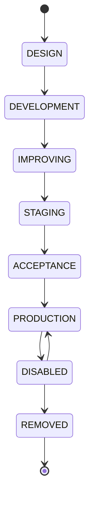

# Deployment lifecycle

## Summary

Defines rule deployment statuses, promotion strategy, proxy settings, and debug configuration. Shipped in bundled `deployment.toml`; clients MAY override via `.opentide/configurations/deployment.toml`.

## Requirements

- Every rule `status` value MUST match a configured status `name` in merged `deployment.toml`.
- Status promotion MUST respect `[promotion]` settings when `promotion.enabled` is true.
- Deprecated statuses MUST NOT be used for new rules (opentide emits warnings).
- Platform-specific `status` on configuration blocks MUST also be valid deployment statuses when set.

## Definition

### Status entries (`[[statuses]]`)

| Field | Type | Required | Description |
|-------|------|----------|-------------|
| `name` | string | yes | Status identifier (e.g. `STAGING`) |
| `description` | string | yes | Human-readable description |
| `strategy` | string | yes | Deployment strategy enum |

### Bundled statuses

| Name | Strategy | Description |
|------|----------|-------------|
| `DESIGN` | `INERT` | Under active functional design, without technical translation |
| `DEVELOPMENT` | `PREVIEW` | Under active technical implementation |
| `IMPROVING` | `PREVIEW` | Functionally qualified, undergoing refinement |
| `STAGING` | `PREVIEW` | Deployed in staging for operational testing |
| `ACCEPTANCE` | `PREVIEW` | Ready for production; analyst validates alert and playbook |
| `PRODUCTION` | `RELEASE` | Active production deployment |
| `DISABLED` | `DISABLEMENT` | Accessible but not active |
| `REMOVED` | `DELETION` | Fully deprecated, archival flag only |

### Strategy semantics

The `strategy` on a status determines what `opentide deploy` does with a rule in that status:

| Strategy | Deploy behaviour |
|----------|------------------|
| `INERT` | Rule is not deployed to any platform |
| `PREVIEW` | Rule is deployed to staging/preview targets only |
| `RELEASE` | Rule is deployed to production targets |
| `DISABLEMENT` | Any active deployment of the rule is disabled (kept but inactive) |
| `DELETION` | The rule is removed from platforms |

### Lifecycle transitions

Statuses form a progression from design to production and on to retirement. Promotion moves a rule forward; a rule MAY also be disabled or removed from any active state.

Promotion targets are governed by `[promotion]`; the default target is `PRODUCTION`. The transition graph itself is a convention of the bundled lifecycle — clients that override `deployment.toml` define their own statuses and therefore their own progression.

### `[promotion]`

| Field | Type | Default | Description |
|-------|------|---------|-------------|
| `enabled` | boolean | `true` | Whether status promotion is allowed |
| `promotion_target` | string | `PRODUCTION` | Default target status for promotion |

### `[proxy]`

| Field | Description |
|-------|-------------|
| `proxy_user` | Optional; use with `proxy_password` for auth |
| `proxy_password` | Optional proxy password (env var substitution supported) |
| `proxy_host` | Proxy hostname |
| `proxy_port` | Proxy port |

When both `proxy_user` and `proxy_password` are present, authenticated proxy is used; otherwise host:port only.

### `[debug]`

| Field | Type | Description |
|-------|------|-------------|
| `mdr_test_uuids` | list[string] | UUIDs of rules usable for debugging |
| `proxy_enabled` | boolean | Enable proxy in debug mode |
| `ssl_enabled` | boolean | Enable SSL in debug mode |

### Top-level

| Field | Default | Description |
|-------|---------|-------------|
| `default_responders` | `""` | Default responder team when not set on rule |

## Relationships

- [rule-1.0.md](objects/rule-1.0.md) — `status` field on rules and platform blocks
- [configuration.md](configuration.md) — override mechanism
- [platforms.md](platforms.md) — per-platform deployment
- [metaschema-keywords.md](metaschema-keywords.md) — `tide.config.statuses` keyword

## Defaults & overrides

Bundled `deployment.toml` ships in opentide. Override via `.opentide/configurations/deployment.toml`. Deep merge applies.

## Examples

Default rule status in fixtures: `STAGING` — see [fixtures/valid/rule-1.0.yaml](https://github.com/OpenTideHQ/specifications/blob/main/fixtures/valid/rule-1.0.yaml).

## History

| Version | Date | Notes |
|---------|------|-------|
| 1.0 | 2026-06-25 | Initial spec from opentide `deployment.toml` |
