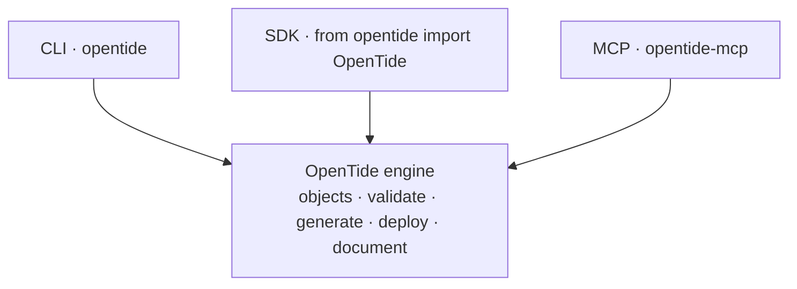

OpenTide exposes the **same engine** three ways. They share the object model, validation, and deployment logic — the difference is who is driving.



## Decision table

| If you are… | Use | Why |
|-------------|-----|-----|
| A person running commands, or a CI pipeline | **[CLI](../cli/index.md)** | Ergonomic, scriptable, sets exit codes for gates |
| Embedding OpenTide in a Python app, service, or test | **[SDK](../sdk/index.md)** | Typed objects, direct access to the registry and results |
| An AI agent in an editor | **[MCP](../mcp/index.md)** | Structured tools/resources with honest capability reporting |

## Rules of thumb

- **Start with the CLI.** For onboarding, daily authoring, and CI, the CLI is the shortest path. Everything in the [tutorial](./tutorial.md) uses it.
- **Reach for the SDK when you need to compose.** Building a custom report, a bespoke gate, or integrating OpenTide into another tool? The [SDK](../sdk/index.md) gives you the objects and results as Python.
- **Use MCP for agents, not automation.** MCP is for interactive AI assistance in an editor. For unattended pipelines, use the CLI — and remember MCP's `validate_query`/`run_query` are [stubs](./workflows/agentic-setup.md).

## The same operation, three ways

Validating a rule:

<Tabs items={['CLI', 'SDK', 'MCP']}>

<Tab value="CLI">

```bash
opentide validate --uuid 00000000-0000-4000-8003-000000000001 --strict
```

</Tab>

<Tab value="SDK">

```python
from opentide import OpenTide
OpenTide.initialise()
result = OpenTide.Rules["00000000-0000-4000-8003-000000000001"].validate()
print(result.ok, result.errors)
```

</Tab>

<Tab value="MCP">

```text
validation_report(uuid="00000000-0000-4000-8003-000000000001")
```

</Tab>

</Tabs>

## Capabilities compared

| Capability | CLI | SDK | MCP |
|------------|:---:|:---:|:---:|
| Validate objects | ✅ | ✅ | ✅ |
| Validate query syntax | ✅ | ✅ | ⚠️ stub |
| Generate schemas/templates | ✅ | ✅ | — |
| Deploy (dry-run + real) | ✅ | ✅ | dry-run focus |
| Document | ✅ | ✅ | — |
| Search / coverage / chaining | via `info` | via registry | ✅ tools |
| Best for | humans + CI | Python integration | agents |

## Next

- [CLI reference](../cli/index.md)
- [SDK reference](../sdk/index.md)
- [MCP reference](../mcp/index.md)
