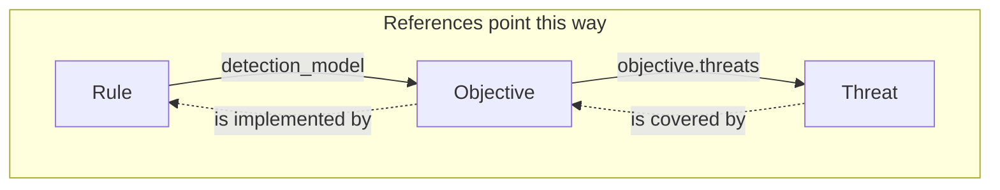

# Object model

OpenTide organises detection content into three object families under `objects/`. Together they answer three questions: **what do we defend against?** (threat), **what are we trying to detect?** (objective), and **how do we detect it?** (rule).

| Object | Answers | Directory | Schema | Acronym |
|--------|---------|-----------|--------|---------|
| **Threat** | What do we defend against? | `objects/threats/` | `threat::1.0` | TVM — Threat Vector Model |
| **Objective** | What are we trying to detect? | `objects/objectives/` | `objective::1.0` | DOM — Detection Objective Model |
| **Rule** | How do we detect it, on which platform? | `objects/rules/` | `rule::1.0` | MDR — Managed Detection Rule |

Every object is a YAML file with a top-level `name` and a shared `metadata` block. The normative field lists live in the [specifications](/docs/specifications/); this page is the working author's tour.

## The shared metadata block

```yaml
metadata:
  uuid: 00000000-0000-4000-8003-000000000001  # stable identity — references use this
  schema: rule::1.0                            # structural revision (selects the model)
  version: 1                                   # instance content version (semver-ish)
  created: "2026-01-01"
  modified: "2026-01-02"
  tlp: clear                                   # sharing sensitivity
```

`uuid` is the identity that never changes — cross-object links use it, so you can rename or move files freely. `schema` vs `version` trips people up; see [Schema revision](./schema-revision.md).

## A worked example: one chain

The clearest way to understand the model is to read one full chain — a threat, an objective that covers it, and a rule that implements that objective. These mirror the conformance [fixtures](https://github.com/OpenTideHQ/specifications/blob/main/fixtures/valid).

### 1. Threat — what we defend against

```yaml
name: Simulated Actor
criticality: High
metadata:
  uuid: 00000000-0000-4000-8001-000000000001
  schema: threat::1.0
  version: 1
  tlp: clear
threat:
  description: Simulated threat actor for credential access
  severity: High
  impact: Data Breach
  leverage: High
  viability: High
  terrain: Endpoint          # drawn from the `surface` vocabulary
  att&ck:
    - T1059
```

### 2. Objective — what we want to detect

The objective references the threat by UUID under `objective.threats`, and declares the **signals** that satisfy the goal.

```yaml
name: Credential Access Objective
metadata:
  uuid: 00000000-0000-4000-8002-000000000001
  schema: objective::1.0
  version: 1
  tlp: clear
composition:
  strategy: synergetic
  description: Compose signals for credential access detection
objective:
  priority: High
  type: Threat
  description: Detect credential access techniques
  composition:                 # mirrors the top-level composition
    strategy: synergetic
    description: Compose signals for credential access detection
  threats:
    - 00000000-0000-4000-8001-000000000001   # ← the threat above
  signals:
    - name: Suspicious logon signal
      uuid: 00000000-0000-4000-8099-000000000001
      description: Suspicious authentication activity
      severity: Medium
      methodology: analytics
      entities: [host]
      data:
        availability: Complete
        requirements: Security event logs
```

### 3. Rule — how we detect it

The rule references the objective by UUID via `detection_model`, and carries one configuration block per platform it deploys to.

```yaml
name: Sentinel KQL Rule
metadata:
  uuid: 00000000-0000-4000-8003-000000000001
  schema: rule::1.0
  version: 1
  tlp: clear
description: Detects credential access via suspicious process creation
status: STAGING
severity: High
techniques: [T1059]
detection_model: 00000000-0000-4000-8002-000000000001   # ← the objective above
response:
  alert_severity: High
configurations:
  sentinel:
    enabled: true
    name: Sentinel KQL Rule
    status: STAGING
    query: |
      SecurityEvent
      | where EventID == 4688
      | take 1
    scheduling:
      frequency: PT1H
      lookback: PT2H
    alert:
      title: Sentinel KQL Rule
      suppression: false
```

## Chaining

Objects reference each other by UUID. References point **rule → objective → threat**; detection **coverage** flows the other way.



Inspect the graph without reading YAML by hand:

```bash
opentide info                      # summary of objects and their links
opentide --json info --technique T1059 coverage   # coverage for one ATT&CK technique
```

```text
# MCP equivalent
get_chaining(uuid="00000000-0000-4000-8002-000000000001")
```

Cross-object reference and chaining checks run as part of full [validation](../../cli/validate.md).

### Anti-patterns to avoid

<Callout type="warn">
The validator catches these, but designing against them keeps your graph healthy.
</Callout>

- **Orphan rule** — a rule whose `detection_model` points at no existing objective (or omits it when your policy requires one). It deploys, but nobody can say what threat it addresses.
- **Dangling reference** — an `objective.threats` UUID that no threat file defines. Usually a typo or a deleted object.
- **Duplicate UUID** — two objects sharing a UUID. Uniqueness is enforced; regenerate UUIDs, never hand-copy them.
- **Circular chain** — objectives that reference each other in a loop. Keep the graph a DAG: threat ← objective ← rule.
- **Coverage island** — a threat that no objective covers. Valid, but it is a visible gap in your coverage report — often intentional, sometimes a to-do.

## Typed Python access

The same objects are available programmatically through the [registry](../../sdk/registry.md):

```python
from opentide import OpenTide

OpenTide.initialise()
rule = OpenTide.Rules["00000000-0000-4000-8003-000000000001"]
objective = OpenTide.Objectives["00000000-0000-4000-8002-000000000001"]
threat = OpenTide.Threats["00000000-0000-4000-8001-000000000001"]

obj = OpenTide.lookup("00000000-0000-4000-8002-000000000001")  # cross-type lookup
```

Rules loaded through the registry expose delegation methods: `validate()`, `validate_query(platform)`, `deploy()`, and `document()`. See [SDK models](../../sdk/models.md).

## Generated artifacts

After `opentide generate`:

| Artifact | Location |
|----------|----------|
| JSON Schema | `.opentide/schemas/{family}.{major}.{minor}.schema.json` |
| Template | `.opentide/templates/{family}.{major}.{minor}.template.yaml` |
| IDE router | `.opentide/schemas/opentide.schema.json` |

## Further reading

- [Schema revision](./schema-revision.md) — `metadata.schema` vs `metadata.version`.
- [Platforms](./platforms.md) — where rules deploy and validate.
- [Tutorial](../tutorial.md) — author this exact chain yourself, end to end.
- Normative specs: [Threat](/docs/specifications/specs/objects/threat-1.0/) · [Objective](/docs/specifications/specs/objects/objective-1.0/) · [Rule](/docs/specifications/specs/objects/rule-1.0/) · [Metadata](/docs/specifications/specs/metadata/).
