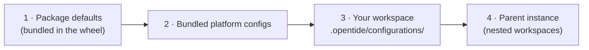

# Configuration

OpenTide ships sensible defaults inside the package. Your repository customises them under `.opentide/configurations/`. This guide is the practical tour of that directory; the normative merge rules live in the [Configuration spec](/docs/specifications/specs/configuration/).

## How configuration is layered

OpenTide deep-merges configuration from several sources. Later layers win; nested tables merge, scalars replace.



You only ever edit **layer 3** — your workspace. You override just the keys you care about; everything else falls through to the package defaults.

```
.opentide/configurations/
├── paths.toml              # workspace directory layout
├── deployment.toml         # statuses + promotion
├── schema.toml             # template defaults, vocabulary extensions
├── visibility.toml         # what is exposed/deployed
├── documentation.toml      # `opentide document` settings
└── platforms/
    ├── sentinel.toml
    └── splunk.toml
```

<Callout type="warn">
Do not put vocabulary files here. Vocabularies are canonical in the [specifications](/docs/specifications/specs/vocabularies/format/); extend them through `schema.toml`, never by copying `.vocab.toml` files.
</Callout>

## Enabling a platform

A platform is loaded only when it is enabled in your workspace config. Create one file per platform under `platforms/`:

```toml
# .opentide/configurations/platforms/sentinel.toml
[platform]
enabled = true
```

Confirm what the engine actually loaded:

```bash
opentide info
opentide --json info --platform sentinel
```

See [Platforms](./concepts/platforms.md) for the capability matrix and the exact `--platform` identifiers.

## Credentials

Deploying rules or running live query checks needs platform credentials. Keep secrets out of the repo — reference environment variables from the platform TOML and inject them at runtime (locally via a `.env` you never commit, in CI via secrets).

```toml
# .opentide/configurations/platforms/sentinel.toml
[platform]
enabled = true

[platform.connection]
tenant_id = "${AZURE_TENANT_ID}"
client_id = "${AZURE_CLIENT_ID}"
client_secret = "${AZURE_CLIENT_SECRET}"
workspace_id = "${SENTINEL_WORKSPACE_ID}"
```

<Callout type="info">
Exact connection keys differ per platform. Use `opentide info --platform <name>` to see what a platform expects, and never commit real secrets — see [CI/CD](./workflows/ci-cd.md#secrets) for injecting them in pipelines.
</Callout>

If you sit behind an outbound proxy, configure it in `deployment.toml`:

```toml
[proxy]
proxy_host = "proxy.internal"
proxy_port = 8080
proxy_user = "${PROXY_USER}"          # optional; enables authenticated proxy
proxy_password = "${PROXY_PASSWORD}"
```

## Deployment statuses and strategies

Every rule's `status` must match a status defined in the merged `deployment.toml`. OpenTide ships this lifecycle out of the box:

| Status | Strategy | What it does |
|--------|----------|--------------|
| `DESIGN` | `INERT` | Functional design only — never deployed |
| `DEVELOPMENT` | `PREVIEW` | Under technical implementation |
| `IMPROVING` | `PREVIEW` | Qualified, being refined |
| `STAGING` | `PREVIEW` | Deployed to staging for operational testing |
| `ACCEPTANCE` | `PREVIEW` | Production-ready; analyst validating alert + playbook |
| `PRODUCTION` | `RELEASE` | Live production deployment |
| `DISABLED` | `DISABLEMENT` | Present but inactive |
| `REMOVED` | `DELETION` | Removed from platforms |

The **strategy** decides how `deploy` treats a rule: `INERT` never deploys, `PREVIEW` targets staging, `RELEASE` goes to production, `DISABLEMENT`/`DELETION` tear down. You can add or rename statuses by overriding `deployment.toml`:

```toml
# .opentide/configurations/deployment.toml
[[statuses]]
name = "PILOT"
description = "Limited rollout to a pilot workspace"
strategy = "PREVIEW"
```

Full field contract: [Deployment spec](/docs/specifications/specs/deployment/).

## Promotion

Promotion advances rules from a lower status to a higher one — usually `STAGING → PRODUCTION`.

```toml
# .opentide/configurations/deployment.toml
[promotion]
enabled = true
promotion_target = "PRODUCTION"
```

Bulk-promote with the CLI (target comes from `promotion_target`; edits YAML in place — commit the result):

```bash
opentide mutate promote
```

See the [detection-as-code workflow](./workflows/detection-as-code.md#status-lifecycle) for how status and promotion fit day-to-day work.

## Deployment plan

The `DEPLOYMENT_PLAN` environment variable selects which plan `deploy` and `validate query` operate under, letting you keep separate plans (e.g. per environment) without editing config:

```bash
export DEPLOYMENT_PLAN=production
opentide deploy --platform sentinel
```

See [CLI global options](../cli/global-options.md) for how it resolves.

## Visibility and documentation

- `visibility.toml` controls which objects are exposed/deployed in a given context; it is validated by a generated `visibility` schema.
- `documentation.toml` tunes `opentide document` output (which folders, which sections). See [`document`](../cli/document.md).

## Paths

`paths.toml` overrides the default workspace layout (where `objects/`, `docs/`, and `.opentide/` live). Most repos never touch it; the defaults are described in the [Workspace spec](/docs/specifications/specs/workspace/).

## Related

- [Configuration spec](/docs/specifications/specs/configuration/) — normative merge order and file contract.
- [Repository setup](./repository-setup.md) — how `opentide setup` scaffolds this directory.
- [Troubleshooting](./troubleshooting.md) — "unknown status", "platform not loaded", and other config errors.
