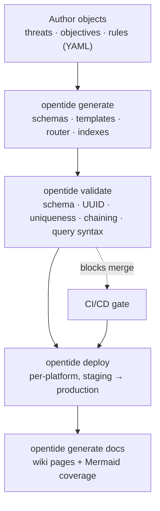

This page is the mental model. Everything else in the docs is a detail of one of these steps. Read it once and the CLI, SDK, and MCP surfaces will make sense.

## The lifecycle

opentide turns a repository of detection **objects** into validated, deployed, and documented detections. The engine sits between your YAML and your platforms.

## The pieces

| Concept | What it is | Where it lives |
|---------|-----------|----------------|
| **Objects** | Threats, objectives, and rules — the detection content you author | `objects/{threats,objectives,rules}/*.yaml` |
| **Specifications** | The normative contract every object must satisfy | [opentide.org/docs/specifications](/docs/specifications/) |
| **Generated artifacts** | JSON Schemas, templates, IDE router, indexes derived from specs + objects | `.opentide/schemas/`, `.opentide/templates/` |
| **Configuration** | Client overrides: enabled platforms, credentials, deployment plan, promotion | `.opentide/configurations/` |
| **Platforms** | The SIEM/EDR targets you deploy to and (sometimes) validate against | plugin registry, see [Platforms](/docs/usage/concepts/platforms/) |

## The steps

<Steps>

<Step>

### Author

You write **objects** as YAML in `objects/`. A [threat](/docs/usage/concepts/object-model/) describes what you defend against, an [objective](/docs/usage/concepts/object-model/) describes a detection goal and its signals, and a [rule](/docs/usage/concepts/object-model/) is the deployable detection with per-platform queries. Objects reference each other by UUID to form a coverage graph.

</Step>

<Step>

### Generate

`opentide generate` compiles the specs and your objects into the scaffolding your repo needs: JSON Schemas per object family, authoring templates from Pydantic `FieldInfo`, an IDE schema router that validates YAML in your editor, and lookup indexes. Generated files are deterministic and safe to commit. See [`generate`](/docs/cli/generate/).

</Step>

<Step>

### Validate

`opentide validate` checks every object against its declared schema, verifies UUID format and uniqueness, resolves cross-object references (no orphans, no dangling links), and — for [supported platforms](/docs/usage/concepts/platforms/) — checks query syntax. Errors exit `1`. Warnings alone exit `0` unless you pass `--strict` (exit `1`). See [`validate`](/docs/cli/validate/) and [Exit codes](/docs/cli/exit-codes/).

</Step>

<Step>

### Deploy

`opentide deploy` pushes rules to a platform, honoring each rule's `status` (e.g. `STAGING`, `PRODUCTION`) and your deployment plan. Deploys are typically staged first, then **promoted**. Use `--dry-run` to preview. See [`deploy`](/docs/cli/deploy/) and [Configuration](/docs/usage/configuration/).

</Step>

<Step>

### Document

`opentide generate docs` renders human-readable wiki pages for every object, with Mermaid diagrams for chaining and ATT&CK coverage. This is how the rest of the org sees what your detections do. See [`generate docs`](/docs/cli/generate/).

</Step>

</Steps>

## Three interfaces, one engine

The same operations are available three ways. Pick per task — see [Choosing an interface](/docs/usage/choosing-an-interface/).

| Interface | Best for | Reference |
|-----------|----------|-----------|
| **CLI** (`opentide`) | Humans, CI pipelines, scripts | [CLI](/docs/cli/) |
| **SDK** (`from opentide import OpenTide`) | Embedding in Python tools and tests | [SDK](/docs/sdk/) |
| **MCP** (`opentide-mcp`) | AI agents in editors | [MCP](/docs/mcp/) |

## Where generation and deployment differ

A common point of confusion:

- **`generate`** produces *framework scaffolding* (schemas, templates, router) inside `.opentide/`. Run it after upgrading opentide or changing schema revisions.
- **`generate docs`** produces *human wiki pages* from your loaded objects. Run it after content changes.
- **`deploy`** pushes *rules to platforms*. It reads objects; it does not regenerate scaffolding.

## Next

- [Object model](/docs/usage/concepts/object-model/) — a close look at threats, objectives, and rules.
- [Installation](/docs/usage/installation/) then [Repository setup](/docs/usage/repository-setup/) — get a repo on disk.
- [Tutorial](/docs/usage/tutorial/) — do the whole lifecycle once, end to end.
