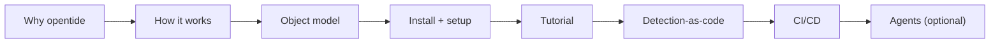

opentide is the **DetectionOps engine**: a versioned toolchain for building, validating, deploying, and documenting detection content as code across enterprise security platforms. This section takes you from "what is it?" to a working, CI-gated detection repository.

<Callout type="info">
New here? Read [Why opentide](./why-opentide.md) and [How opentide works](./how-it-works.md) first — they give you the mental model that every other page assumes.
</Callout>

## Start with the concepts

Detection content in opentide is a small graph of typed objects. Understanding that graph before you touch the CLI saves hours.

<Cards>
  <Card title="How opentide works" href="./how-it-works.md" description="The full lifecycle: author → generate → validate → deploy → document." />
  <Card title="Object model" href="./concepts/object-model.md" description="Threats, objectives, and rules — and how they chain together." />
  <Card title="Platforms" href="./concepts/platforms.md" description="Which SIEM/EDR platforms deploy and which support query validation." />
  <Card title="Releases" href="./releases.md" description="What's on PyPI — install the latest, lock a version in CI when you need a freeze." />
</Cards>

## Pick your path

opentide serves several audiences. Follow the path that matches you.

| You are… | Start here | Then |
|-----------|-----------|------|
| **New to opentide, greenfield repo** | [Installation](./installation.md) → [Repository setup](./repository-setup.md) | [Tutorial](./tutorial.md) → [Detection-as-code](./workflows/detection-as-code.md) |
| **Checking what shipped** | [Releases](./releases.md) | [opentide on PyPI](https://pypi.org/project/opentide/) |
| **Evaluating the project** | [Why opentide](./why-opentide.md) → [How it works](./how-it-works.md) | [Object model](./concepts/object-model.md) |
| **Migrating from CoreTide** | [Migration guide](./migration/index.md) | [Configuration](./configuration.md) |
| **Wiring up an AI agent** | [Agentic setup](./workflows/agentic-setup.md) | [MCP reference](../mcp/index.md) |
| **Embedding opentide in Python** | [SDK](../sdk/index.md) | [SDK registry](../sdk/registry.md) |

## The recommended read order

If you read one thing after another, read them in this order:

## Everyday reference

- [Configuration](./configuration.md) — credentials, enabling platforms, deployment plans, promotion.
- [Troubleshooting](./troubleshooting.md) — what to do when `validate` or `generate` fails.
- [CLI](../cli/index.md) · [MCP](../mcp/index.md) · [SDK](../sdk/index.md) — the three interfaces to the same engine.
- [Specifications](/docs/specifications/) — the normative contract behind every object and field.
