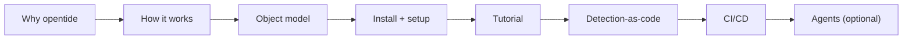

opentide is the **DetectionOps engine**: a versioned toolchain for building, validating, deploying, and documenting detection content as code across enterprise security platforms. This section takes you from "what is it?" to a working, CI-gated detection repository.

<Callout type="info">
New here? Read [Why opentide](/docs/usage/why-opentide/) and [How opentide works](/docs/usage/how-it-works/) first — they give you the mental model that every other page assumes.
</Callout>

## Start with the concepts

Detection content in opentide is a small graph of typed objects. Understanding that graph before you touch the CLI saves hours.

<Cards>
  <Card title="How opentide works" href="/docs/usage/how-it-works/" description="The full lifecycle: author → generate → validate → deploy → document." />
  <Card title="Object model" href="/docs/usage/concepts/object-model/" description="Threats, objectives, and rules — and how they chain together." />
  <Card title="Platforms" href="/docs/usage/concepts/platforms/" description="Which SIEM/EDR platforms deploy and which support query validation." />
  <Card title="0.1.7 release" href="/docs/usage/releases/" description="Current PyPI patch — pin opentide==0.1.7 (VS Code schemas, templates, and validate JSON)." />
</Cards>

## Pick your path

opentide serves several audiences. Follow the path that matches you.

| You are… | Start here | Then |
|-----------|-----------|------|
| **New to opentide, greenfield repo** | [Installation](/docs/usage/installation/) → [Repository setup](/docs/usage/repository-setup/) | [Tutorial](/docs/usage/tutorial/) → [Detection-as-code](/docs/usage/workflows/detection-as-code/) |
| **Checking what shipped** | [Releases](/docs/usage/releases/) | [0.1.7 on PyPI](https://pypi.org/project/opentide/0.1.7/) |
| **Evaluating the project** | [Why opentide](/docs/usage/why-opentide/) → [How it works](/docs/usage/how-it-works/) | [Object model](/docs/usage/concepts/object-model/) |
| **Migrating from CoreTide** | [Migration guide](/docs/usage/migration/) | [Configuration](/docs/usage/configuration/) |
| **Wiring up an AI agent** | [Agentic setup](/docs/usage/workflows/agentic-setup/) | [MCP reference](/docs/mcp/) |
| **Embedding opentide in Python** | [SDK](/docs/sdk/) | [SDK registry](/docs/sdk/registry/) |

## The recommended read order

If you read one thing after another, read them in this order:

## Everyday reference

- [Configuration](/docs/usage/configuration/) — credentials, enabling platforms, deployment plans, promotion.
- [Troubleshooting](/docs/usage/troubleshooting/) — what to do when `validate` or `generate` fails.
- [CLI](/docs/cli/) · [MCP](/docs/mcp/) · [SDK](/docs/sdk/) — the three interfaces to the same engine.
- [Specifications](/docs/specifications/) — the normative contract behind every object and field.
