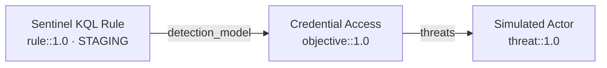

# Tutorial: your first detection

The [quickstart](./quickstart.md) runs commands against an existing repo. This tutorial is different: you will **author a real detection chain from nothing** and take it through the whole lifecycle. By the end you will have a threat, an objective, and a Sentinel rule that reference each other, pass strict validation, and are ready to deploy.

Budget 15–20 minutes. You need Python 3.10+ and `opentide` installed — see [Installation](./installation.md).

<Callout type="info">
Everything here mirrors the conformance [fixtures](https://github.com/OpenTideHQ/specifications/blob/main/fixtures/valid). If you get stuck, those files are known-good references.
</Callout>

## 1. Scaffold a repository

```bash
opentide setup --yes \
  --name "Tutorial Detections" \
  --org "Example Corp" \
  --platform sentinel \
  --path ./tutorial-detections

cd tutorial-detections
export OPENTIDE_REPO_ROOT="$PWD"
```

You now have `objects/{threats,objectives,rules}/`, a `.opentide/` config directory, and platform scaffolding. See [Repository setup](./repository-setup.md) for what each piece is.

## 2. Generate the framework artifacts

Before validation can work, the schemas and templates must exist:

```bash
opentide generate
```

```text
✓ vocabularies loaded
✓ templates written        .opentide/templates/
✓ schemas written          .opentide/schemas/
✓ IDE router               .opentide/schemas/opentide.schema.json
generate: complete
```

Your editor can now validate `objects/**/*.yaml` live, because the router maps each file's `metadata.schema` to the right JSON Schema.

## 3. Author the threat

Create `objects/threats/simulated-actor.yaml`:

```yaml
name: Simulated Actor
criticality: High
metadata:
  uuid: 00000000-0000-4000-8001-000000000001
  schema: threat::1.0
  version: 1
  tlp: clear
threat:
  description: Simulated threat actor exercising credential access
  severity: High
  impact: Data Breach
  leverage: High
  viability: High
  terrain: Endpoint workstations and user devices.
  surface:
    - Windows::Desktop
  att&ck:
    - T1059
```

<Callout type="warn">
Generate real UUIDs for your own content (`python -c "import uuid; print(uuid.uuid4())"`). The zero-padded UUIDs here match the fixtures so the tutorial is easy to follow — never hand-copy UUIDs into real objects.
</Callout>

## 4. Author the objective

The objective covers the threat (by UUID) and declares the signals that satisfy it. Create `objects/objectives/credential-access.yaml`:

```yaml
name: Credential Access Objective
metadata:
  uuid: 00000000-0000-4000-8002-000000000001
  schema: objective::1.0
  version: 1
  tlp: clear
composition:
  strategy: synergetic
  description: Compose signals for credential access detection
objective:
  priority: High
  type: Threat
  description: Detect credential access techniques
  composition:
    strategy: synergetic
    description: Compose signals for credential access detection
  threats:
    - 00000000-0000-4000-8001-000000000001   # the threat from step 3
  signals:
    - name: Suspicious logon signal
      uuid: 00000000-0000-4000-8099-000000000001
      description: Suspicious authentication activity
      severity: Medium
      methodology: analytics
      entities: [host]
      data:
        availability: Complete
        requirements: Security event logs
```

## 5. Author the rule

The rule implements the objective (via `detection_model`) and carries a Sentinel query. Create `objects/rules/sentinel-suspicious-process.yaml`:

```yaml
name: Sentinel KQL Rule
metadata:
  uuid: 00000000-0000-4000-8003-000000000001
  schema: rule::1.0
  version: 1
  tlp: clear
description: Detects credential access via suspicious process creation
status: STAGING
severity: High
techniques: [T1059]
detection_model: 00000000-0000-4000-8002-000000000001   # the objective from step 4
response:
  alert_severity: High
configurations:
  sentinel:
    enabled: true
    name: Sentinel KQL Rule
    status: STAGING
    query: |
      SecurityEvent
      | where EventID == 4688
      | take 1
    scheduling:
      frequency: PT1H
      lookback: PT2H
    alert:
      title: Sentinel KQL Rule
      suppression: false
```

## 6. Validate

```bash
opentide validate --strict
```

```text
✓ schema           3 objects
✓ uuid             format + uniqueness
✓ cross-object     references resolved
✓ chaining         rule → objective → threat
validate: PASS (3 objects, 0 errors)
```

`--strict` treats warnings as failures — this is exactly what CI runs. See [`validate`](../cli/validate.md).

## 7. Break it on purpose

Understanding failure output is half the job. Change the rule's `detection_model` to a UUID that does not exist:

```yaml
detection_model: 00000000-0000-4000-8002-DEADBEEF0000
```

Re-run:

```bash
opentide validate --strict
```

```text
✗ chaining         rule 00000000-0000-4000-8003-000000000001
                   detection_model points to unknown objective
                   00000000-0000-4000-8002-DEADBEEF0000
validate: FAIL (1 error)
```

This is the **dangling reference** anti-pattern from the [object model](./concepts/object-model.md#anti-patterns-to-avoid). Restore the correct UUID and validation passes again.

## 8. Check the coverage graph

```bash
opentide info
opentide --json info --technique T1059 coverage
```

`info` shows your objects and how they chain; the coverage query shows that T1059 is now covered by one objective and one rule. See [`info`](../cli/info.md).

## 9. Validate the query and dry-run the deploy

Sentinel supports query validation, so check the KQL before deploying:

```bash
opentide validate query --platform sentinel
opentide deploy --platform sentinel --dry-run
```

```text
deploy (dry-run): sentinel
  Sentinel KQL Rule  STAGING  → would create/update
deploy: 1 rule planned, 0 applied (dry-run)
```

`--dry-run` shows exactly what a real deploy would change without touching the platform. A real deploy needs [credentials](./configuration.md#credentials); remove `--dry-run` when you are ready.

## 10. Generate documentation

```bash
opentide generate docs
```

This renders wiki-style markdown for each object under `docs/`, including a Mermaid diagram of the chain you just built. See [`generate docs`](../cli/generate.md).

## What you built



## Next steps

- [Detection-as-code](./workflows/detection-as-code.md) — the daily authoring and review loop.
- [CI/CD](./workflows/ci-cd.md) — gate this validation on every pull request.
- [Configuration](./configuration.md) — real credentials, statuses, and promotion.
- [Troubleshooting](./troubleshooting.md) — when a step above does not behave.
