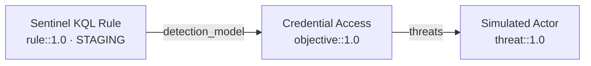

The [quickstart](/docs/usage/quickstart/) runs commands against an existing repo. This tutorial is different: you will **author a real detection chain from nothing** and take it through the whole lifecycle. By the end you will have a threat, an objective, and a Sentinel rule that reference each other, pass validation, and are ready to deploy.

Budget 15–20 minutes. You need Python 3.10+ and `opentide` installed — see [Installation](/docs/usage/installation/).

<Callout type="info">
Everything here mirrors the conformance [fixtures](https://github.com/OpenTideHQ/specifications/blob/main/fixtures/valid). If you get stuck, those files are known-good references.
</Callout>

## 1. Scaffold a repository

```bash
opentide setup --yes \
  --name "Tutorial Detections" \
  --org "Example Corp" \
  --platform sentinel \
  --path ./tutorial-detections

cd tutorial-detections
export OPENTIDE_REPO_ROOT="$PWD"
```

You now have `objects/{threats,objectives,rules}/`, a `.opentide/` config directory, and platform scaffolding. See [Repository setup](/docs/usage/repository-setup/) for what each piece is.

## 2. Generate the framework artifacts

Before validation can work, the schemas and templates must exist:

```bash
opentide generate
```

```text
== Documentation generation ==
== Export generation ==
== Object vocabulary generation ==
== Template generation ==
== JSON schema generation ==
== VS Code snippet generation ==
OK Full generation pipeline completed
```

This is the output with `--no-color` or `NO_COLOR` set; otherwise each `== … ==` header is drawn as a horizontal rule. Phase headers go to stderr and the final status to stdout, so `opentide generate > log.txt` keeps the headers on your terminal. Artifacts land in `.opentide/templates/`, `.opentide/schemas/`, and the IDE router at `.opentide/schemas/opentide.schema.json`.

Your editor can now validate YAML under `objects/threats/`, `objects/objectives/`, and `objects/rules/` because `opentide setup vscode` maps each folder to its concrete JSON Schema (not the router glob, which the YAML language server cannot narrow).

## 3. Author the threat

Create `objects/threats/simulated-actor.yaml`:

```yaml
name: Simulated Actor
criticality: High
metadata:
  uuid: 00000000-0000-4000-8001-000000000001
  schema: threat::1.0
  version: 1
  created: 2026-01-01
  modified: 2026-01-02
  tlp: clear
  author: Tutorial Author
  organisation:
    uuid: 00000000-0000-4000-8000-000000000099
    name: Example Corp
threat:
  description: Simulated threat actor exercising credential access
  severity: Substantial incident
  impact:
    - Data Breach
  leverage:
    - Information Gathering
  viability: Likely
  terrain: Endpoint workstations and user devices.
  surface:
    - Windows::Desktop
  att&ck:
    - T1059
  actors:
    - name: att&ck::G0006
```

`threat.impact` and `threat.leverage` are lists with one vocabulary name per item. Add another `- …` line for each extra name; a single string, or several names joined with `;`, fails validation.

`threat.actors` is a list of **objects**. `name` is a scoped actors-vocabulary ID (`att&ck::G0006` is APT1). Optional `sighting` and `references` record why that actor is attributed. `opentide generate` enriches `name` when it writes the objects export.

<Callout type="warn">
Generate real UUIDs for your own content (`python -c "import uuid; print(uuid.uuid4())"`). The zero-padded UUIDs here match the fixtures so the tutorial is easy to follow — never hand-copy UUIDs into real objects.
</Callout>

## 4. Author the objective

The objective covers the threat (by UUID) and declares the signals that satisfy it. Create `objects/objectives/credential-access-objective.yaml`:

```yaml
name: Credential Access Objective
metadata:
  uuid: 00000000-0000-4000-8002-000000000001
  schema: objective::1.0
  version: 1
  created: 2026-01-01
  modified: 2026-01-02
  tlp: clear
  author: Tutorial Author
  organisation:
    uuid: 00000000-0000-4000-8000-000000000099
    name: Example Corp
composition:
  strategy: Combined
  description: Compose signals for credential access detection
objective:
  priority: High
  type: Threat
  description: Detect credential access techniques
  composition:
    strategy: Combined
    description: Compose signals for credential access detection
  threats:
    - 00000000-0000-4000-8001-000000000001   # the threat from step 3
  signals:
    - name: Suspicious logon signal
      uuid: 00000000-0000-4000-8099-000000000001
      description: Suspicious authentication activity
      severity: Moderate incident
      methodology: Statistical
      entities: [Hostname]
      data:
        availability: Complete
        requirements: Security event logs
```

## 5. Author the rule

The rule implements the objective (via `detection_model`) and carries a Sentinel query. Create `objects/rules/sentinel-kql-rule.yaml`:

```yaml
name: Sentinel KQL Rule
metadata:
  uuid: 00000000-0000-4000-8003-000000000001
  schema: rule::1.0
  version: 1
  created: 2026-01-01
  modified: 2026-01-02
  tlp: clear
  author: Tutorial Author
  organisation:
    uuid: 00000000-0000-4000-8000-000000000099
    name: Example Corp
description: Detects credential access via suspicious process creation
status: STAGING
severity: Substantial incident
techniques: [T1059]
detection_model: 00000000-0000-4000-8002-000000000001   # the objective from step 4
response:
  alert_severity: High
configurations:
  sentinel:
    enabled: true
    name: Sentinel KQL Rule
    status: STAGING
    query: |
      SecurityEvent
      | where EventID == 4688
      | take 1
    scheduling:
      frequency: PT1H
      lookback: PT2H
    alert:
      title: Sentinel KQL Rule
      suppression: false
```

## 6. Validate

```bash
opentide validate --strict
opentide lint --strict
```

On success the CLI logs that all content passed validation (exit `0`). Filenames must match `slugify(name)` (for example `sentinel-kql-rule.yaml`) and recommended `metadata.author` / `metadata.organisation` must be present. For a machine-readable report:

```bash
opentide --json validate
```

```json
{
  "checks": {
    "id-uniqueness": { "check": "id-uniqueness", "status": "passed" },
    "uuid-format": { "check": "uuid-format", "status": "passed" },
    "schema": { "check": "schema", "status": "passed" }
  },
  "report": { "ok": true, "issues": [], "warnings": [], "stats": {} },
  "ok": true,
  "status": "passed",
  "message": "Validation passed"
}
```

See [`validate`](/docs/cli/validate/).

## 7. Break it on purpose

Understanding failure output is half the job. Change the rule's `detection_model` to a UUID that does not exist:

```yaml
detection_model: 00000000-0000-4000-8002-DEADBEEF0000
```

Re-run:

```bash
opentide validate
```

Issues print in a "Validation issues" panel, grouped by file. A dangling `detection_model` is an `invalid_ref` from the cross-object reference check (not the threat chaining check):

```text
## objects/rules/sentinel-kql-rule.yaml
  [error] detection_model: Unknown objective reference '00000000-0000-4000-8002-DEADBEEF0000'
```

The process exits `1`. This is the **dangling reference** anti-pattern from the [object model](/docs/usage/concepts/object-model/#anti-patterns-to-avoid). Restore the correct UUID and validation passes again.

## 8. Check the coverage graph

```bash
opentide info
opentide --json info --technique T1059 coverage
```

`info` reports the package version, your object counts, and each platform's deploy/validate capabilities; the coverage query shows that T1059 is now covered by one objective and one rule. To see the chain itself, use the Mermaid diagram in [`generate docs`](/docs/cli/generate/) output or the MCP `get_chaining` tool. See [`info`](/docs/cli/info/).

## 9. Validate the query and dry-run the deploy

Sentinel supports query validation, so check the KQL before deploying. `validate query` parses the query offline by default — no Azure SDK and no credentials:

```bash
opentide validate query --platform sentinel
```

```text
OK Offline KQL syntax validation passed for sentinel (1 query across 1 rule)
```

Add `--live` to send the query to Azure Monitor for a real round-trip; that needs `opentide[sentinel]` and credentials. Then dry-run the deploy:

```bash
opentide deploy --platform sentinel --dry-run
```

```text
== MDR Deployment ==
OK Deployment completed
```

`--dry-run` plans the deploy without touching the platform; per-rule detail is logged to stderr, and `opentide --json deploy --platform sentinel --dry-run` returns it as a structured payload. A real deploy needs [credentials](/docs/usage/configuration/#credentials); remove `--dry-run` when you are ready.

## 10. Generate documentation

```bash
opentide generate docs
```

This renders wiki-style markdown for each object under `docs/rules`, `docs/objectives`, and `docs/threats`, including a Mermaid diagram of the chain you just built. See [`generate docs`](/docs/cli/generate/).

## What you built



## Next steps

- [Detection-as-code](/docs/usage/workflows/detection-as-code/) — the daily authoring and review loop.
- [CI/CD](/docs/usage/workflows/ci-cd/) — gate this validation on every pull request.
- [Configuration](/docs/usage/configuration/) — real credentials, statuses, and promotion.
- [Troubleshooting](/docs/usage/troubleshooting/) — when a step above does not behave.
