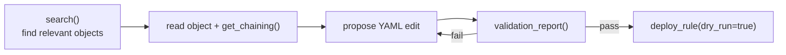

# Agentic setup

OpenTide exposes the engine to AI agents through an [MCP server](../../mcp/index.md) and portable agent skills, so an assistant in your editor can search the catalogue, validate objects, and preview deploys. This page sets it up, shows a realistic session, and is honest about what agents can and cannot do today.

## What agents can and cannot do today

<Callout type="warn">
The MCP `validate_query` and `run_query` tools are **stubs** — they return success without parsing queries or contacting platforms. For real query-syntax checks, agents (or you) must use the CLI: `opentide validate query --platform …`. Use `validation_report` for structured object validation an agent can act on.
</Callout>

| Capability | Status |
|-----------|--------|
| Search catalogue, read objects, inspect chaining | Supported |
| Validate objects (`validate_rule`, `validation_report`) | Supported |
| Dry-run deploy (`deploy_rule`, `dry_run=true`) | Supported |
| Query syntax validation via MCP | Stub — use CLI |
| Live query execution via MCP | Stub — not available |

## Install and configure the server

```bash
pip install opentide
opentide setup mcp --cursor --yes
```

This writes `.cursor/mcp.json`:

```json
{
  "mcpServers": {
    "opentide": {
      "command": "opentide-mcp",
      "env": { "OPENTIDE_REPO_ROOT": "${workspaceFolder}" }
    }
  }
}
```

The server uses **stdio transport**. It must know where your content lives, so set `OPENTIDE_REPO_ROOT` in the host environment (as above). If the server fails to start, see [MCP configuration](../../mcp/configuration.md).

### Supported hosts

| Host | Setup flag | Config path |
|------|------------|-------------|
| VS Code | `--vscode` | `.vscode/mcp.json` |
| Cursor | `--cursor` | `.cursor/mcp.json` |
| Claude Code | `--claude-code` | `.mcp.json` |
| Generic | `--generic` | `opentide.mcp.json` |

## Install agent skills

Skills give the agent durable, project-specific instructions (object layout, commands, the validate-before-deploy rule):

Browse the catalogue, then install selected skills from [OpenTideHQ/skills](https://github.com/OpenTideHQ/skills):

```bash
opentide setup skills discover
opentide setup skills discover --query sentinel
opentide setup skills show opentide-detection-rule

opentide setup skills --yes --generic \
  --name "SOC Detections" \
  --org "Example Corp" \
  --description "Enterprise MDR content"

opentide setup skills --yes --install opentide-detection-rule --install detection-engineering
```

| Target | Files created |
|--------|---------------|
| `--generic` | `AGENTS.md`, `.agents/skills/<slug>/SKILL.md` |
| `--cursor` | `.cursor/skills/<slug>/` copies |
| `--claude-code` | `CLAUDE.md`, `.claude/skills/` |
| `--github-copilot` | `.github/copilot-instructions.md` (also applies `--generic` unless already selected) |

After setup, point your agent at the generated `AGENTS.md` at the repo root — it is the entry point for detection work in your repository.

## A safe agent workflow

Give agents this loop. It searches, validates, and only ever *previews* deploys.



### Example session

> **You:** Add a rule for T1059 credential access on Sentinel.
>
> **Agent:** `search(query="T1059")` → finds the *Credential Access* objective `…8002…0001`.
> `get_chaining(uuid="…8002…0001")` → confirms it covers the *Simulated Actor* threat and has no rule yet.
> Proposes `objects/rules/sentinel-t1059.yaml` with `detection_model` pointing at the objective.
> `validation_report()` → passes schema, uuid, chaining.
> Runs `opentide validate query --platform sentinel` (CLI) for real KQL syntax.
> `deploy_rule(uuid=…, platform="sentinel", dry_run=true)` → shows the planned change.
>
> **You:** review the diff, then deploy for real.

## Safe vs unsafe edit patterns

**Safe — let agents do these**

- Search, read, and summarise objects and coverage.
- Draft new objects from templates, filling required fields.
- Run `validation_report` and surface concrete errors.
- Fix dangling references and vocabulary violations the validator flags.
- Preview deploys with `dry_run=true`.

**Unsafe — keep a human in the loop**

- Real (non-dry-run) deploys to production.
- Bulk promotion of rules to `PRODUCTION` without an explicit human status change and review.
- Editing `.opentide/configurations/` credentials or deployment plans.
- Trusting an MCP `validate_query` "pass" as real syntax validation (it is a stub).
- Regenerating or hand-editing UUIDs to resolve a conflict.

## Recommended guardrails in AGENTS.md

Add rules like these to the generated `AGENTS.md` so the agent respects them:

```md
- Always run `validation_report` before proposing a rule as done.
- Query validation for Sentinel/Defender/Splunk/SentinelOne/Carbon Black MUST use
  the CLI `opentide validate query`; the MCP tool is a stub.
- Never claim query validation for CrowdStrike or HarfangLab — they are deploy-only.
- Deploys are `dry_run=true` unless a human explicitly approves a real deploy.
```

## Reference

- [MCP tools](../../mcp/tools.md) and [resources](../../mcp/resources.md) — the full agent surface.
- [MCP configuration](../../mcp/configuration.md) — multi-repo, deploy safety, host specifics.
- [Detection-as-code](./detection-as-code.md) — the human loop agents assist with.
