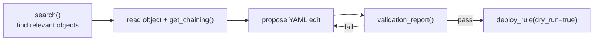

opentide exposes the engine to AI agents through an [MCP server](/docs/mcp/) and portable agent skills, so an assistant in your editor can search the catalogue, validate objects, and preview deploys. This page sets it up, shows a realistic session, and is honest about what agents can and cannot do today.

## What agents can and cannot do today

<Callout type="warn">
`validate_query` refuses unless you pass `live: true`. That call checks the catalogue rules against the tenant. It does not scan the `query` argument. A missing SDK or a missing plan is a failed live check. `run_query` is **not implemented** — it returns `stub: true` with `rows: null` and never contacts a platform. Use `validation_report` for structured object validation an agent can act on.
</Callout>

| Capability | Status |
|-----------|--------|
| Search catalogue, read objects, inspect chaining | Supported |
| Validate objects (`validate_rule`, `validation_report`) | Supported |
| Dry-run deploy (`deploy_rule`, `dry_run=true`) | Supported |
| Tenant query check via MCP (`validate_query`, `live: true`) | Supported — catalogue rules, not the `query` string |
| Live query execution via MCP (`run_query`) | Not implemented |

## Install and configure the server

```bash
pip install 'opentide==0.12.1'
opentide setup mcp --cursor --yes
```

This writes `.cursor/mcp.json`:

```json
{
  "mcpServers": {
    "opentide": {
      "command": "opentide",
      "args": ["mcp", "start"],
      "env": { "OPENTIDE_REPO_ROOT": "${workspaceFolder}" }
    }
  }
}
```

The server uses **stdio transport**. It must know where your content lives, so set `OPENTIDE_REPO_ROOT` in the host environment (as above). If the server fails to start, see [MCP configuration](/docs/mcp/configuration/).

### Supported hosts

| Host | Setup flag | Config path | `OPENTIDE_REPO_ROOT` |
|------|------------|-------------|----------------------|
| VS Code | `--vscode` | `.vscode/mcp.json` (`servers`, not `mcpServers`) | `${workspaceFolder}` |
| Cursor | `--cursor` | `.cursor/mcp.json` | `${workspaceFolder}` |
| Claude Code | `--claude-code` | `.mcp.json` | `${CLAUDE_PROJECT_DIR}` |
| Generic | `--generic` | `opentide.mcp.json` | omitted (cwd discovery) |

## Install agent skills

Skills give the agent durable, project-specific instructions (object layout, commands, the validate-before-deploy rule):

Browse the catalogue with `discover` and `show`. Those commands read the live `manifest.json` from [OpenTideHQ/skills](https://github.com/OpenTideHQ/skills). If that catalogue cannot be fetched, the command fails with an actionable error. `AGENTS.md` is rendered from the package template. The four authoring skills are copied from the package. Every other skill is the full tree under `skills/<slug>/`, including its reference files; an unreadable or truncated tree fails the install instead of writing a partial skill.

```bash
opentide setup skills discover
opentide setup skills discover --query sentinel
opentide setup skills show opentide-detection-rule

opentide setup skills --yes --generic \
  --name "SOC Detections" \
  --org "Example Corp" \
  --description "Enterprise MDR content"

opentide setup skills --yes --install opentide-detection-rule --install detection-engineering
```

| Target | Files created |
|--------|---------------|
| `--generic` | `AGENTS.md`, `.agents/skills/<slug>/SKILL.md` |
| `--cursor` | `.cursor/skills/<slug>/` copies |
| `--claude-code` | `CLAUDE.md`, `.claude/skills/` |
| `--github-copilot` | `.github/copilot-instructions.md` (also applies `--generic` unless already selected) |

After setup, point your agent at the generated `AGENTS.md` at the repo root — it is rendered from the package template for this repository, not copied from the skills catalogue.

`opentide-detection-rule`, `opentide-detection-objective`, `opentide-threat-vector`, and `detection-engineering` are installed from the package so they match `rule::1.0`, `objective::1.0`, and `threat::1.0` under `objects/`. Other skills are downloaded as the full tree under `skills/<slug>/` from OpenTideHQ/skills.

## A safe agent workflow

Give agents this loop. It searches, validates, and only ever *previews* deploys.



### Example session

> **You:** Add a rule for T1059 credential access on Sentinel.
>
> **Agent:** `search(query="T1059")` → finds the *Credential Access* objective `…8002…0001`.
> `get_chaining(uuid="…8002…0001")` → confirms it covers the *Simulated Actor* threat and has no rule yet.
> Proposes `objects/rules/sentinel-t1059.yaml` with `detection_model` pointing at the objective.
> `validation_report()` → passes schema, uuid, chaining.
> Runs `opentide validate query --platform sentinel --live` (CLI) against the tenant.
> `deploy_rule(uuid=…, platform="sentinel", dry_run=true)` → shows the planned change.
>
> **You:** review the diff, then deploy for real.

## Safe vs unsafe edit patterns

**Safe — let agents do these**

- Search, read, and summarise objects and coverage.
- Draft new objects from templates, filling required fields.
- Run `validation_report` and surface concrete errors.
- Fix dangling references and vocabulary violations the validator flags.
- Preview deploys with `dry_run=true`.

**Unsafe — keep a human in the loop**

- Real (non-dry-run) deploys to production.
- Bulk promotion of rules to `PRODUCTION` without an explicit human status change and review.
- Editing `.opentide/configurations/` credentials or deployment plans.
- Trusting an MCP `validate_query` "pass" as proof a query runs — it only proves the query parses.
- Regenerating or hand-editing UUIDs to resolve a conflict.

## Recommended guardrails in AGENTS.md

Add rules like these to the generated `AGENTS.md` so the agent respects them:

```md
- Always run `validation_report` before proposing a rule as done.
- `validate_query` checks structure only. Never report a rule as platform-ready
  on its result alone; `run_query` is not implemented.
- Never claim query validation for CrowdStrike or HarfangLab — they are deploy-only.
- Deploys are `dry_run=true` unless a human explicitly approves a real deploy.
```

## Reference

- [MCP tools](/docs/mcp/tools/) and [resources](/docs/mcp/resources/) — the full agent surface.
- [MCP configuration](/docs/mcp/configuration/) — multi-repo, deploy safety, host specifics.
- [Detection-as-code](/docs/usage/workflows/detection-as-code/) — the human loop agents assist with.
