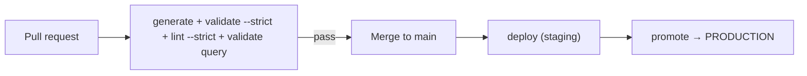

The point of detection-as-code is that a machine enforces quality. A good opentide pipeline **validates every pull request** and **deploys on merge**, promoting to production as a controlled step.



## Scaffold with setup

The fastest start is to let opentide write the pipeline for you:

```bash
opentide setup platforms --sentinel --yes
opentide setup ci github --yes
opentide setup ci gitlab --yes
opentide setup ci azure --python-version 3.12 --yes
```

`setup ci` discovers enabled platforms from `.opentide/configurations/platforms/` — it does not take `--platform` flags (those belong on `setup platforms` or the parent `opentide setup --platform` callback). Generated pipelines install **`opentide>=`** the version that generated them (`opentide>=0.6.1` from 0.6.1) and set `OPENTIDE_REPO_ROOT` for every job (GitHub workflow `env`, GitLab `variables`, Azure pipeline `variables`). Re-run `opentide setup ci` after you upgrade to raise the floor.

<Callout type="info">
Hand-written examples below pin `pip install 'opentide==0.6.1'` so a pipeline cannot float onto an accidental `0.x.dev…` local build. `opentide setup ci` is the source of truth.
</Callout>

| Flag | Default | Purpose |
|------|---------|---------|
| `--staging` / `--no-staging` | staging on | Include the staging deploy stage |
| `--promotion` / `--no-promotion` | omit (keep the repository's setting) | Whether `opentide deploy` promotes rules; `--no-promotion` writes `[promotion] enabled = false` to `.opentide/configurations/deployment.toml` |
| `--promotion-target` | omit (keep the repository's setting) | Status `deploy` promotes rules to; another status is written to the same `[promotion]` table |
| `--python-version` | `3.12` | CI Python version |
| `--default-branch` | `origin/HEAD`, then the checked-out branch, then `init.defaultBranch`, then `main` | Branch that deploys and receives inflight shards (GitHub, Azure; GitLab uses `$CI_DEFAULT_BRANCH`) |

The one-shot `opentide setup --ci <github|gitlab|azure>` accepts the same flags. On a repository without `origin/HEAD` whose deploying branch is not checked out, pass `--default-branch`; the result warns when the detected branch is only a guess.

## Stage 1 — validate every PR

This is the non-negotiable gate. It needs no secrets (query validation checks syntax, not connectivity).

```yaml
# .github/workflows/validate.yml
name: validate
on: pull_request
jobs:
  validate:
    runs-on: ubuntu-latest
    env:
      OPENTIDE_REPO_ROOT: ${{ github.workspace }}
    steps:
      - uses: actions/checkout@v4
      - uses: actions/setup-python@v5
        with: { python-version: "3.12" }
      - run: pip install 'opentide==0.6.1'
      - run: opentide generate
      - run: opentide validate --strict
      - run: opentide validate query --platform sentinel
```

## Stage 2 — deploy on merge (staging)

Runs on push to `main`, deploying rules in their current status. This is where platform **secrets** are needed.

```yaml
# .github/workflows/deploy.yml
name: deploy
on:
  push:
    branches: [main]
jobs:
  deploy-staging:
    runs-on: ubuntu-latest
    environment: staging
    env:
      OPENTIDE_REPO_ROOT: ${{ github.workspace }}
      DEPLOYMENT_PLAN: staging
      AZURE_TENANT_ID: ${{ secrets.AZURE_TENANT_ID }}
      AZURE_CLIENT_ID: ${{ secrets.AZURE_CLIENT_ID }}
      AZURE_CLIENT_SECRET: ${{ secrets.AZURE_CLIENT_SECRET }}
      AZURE_WORKSPACE_ID: ${{ secrets.AZURE_WORKSPACE_ID }}
    steps:
      - uses: actions/checkout@v4
      - uses: actions/setup-python@v5
        with: { python-version: "3.12" }
      - run: pip install 'opentide==0.6.1'
      - run: opentide generate
      - run: opentide deploy --platform sentinel --dry-run   # preview in logs
      - run: opentide deploy --platform sentinel
```

## Stage 3 — promote to production

Promotion is a deliberate step — gate it behind a protected environment or manual approval.

```yaml
  promote-production:
    needs: deploy-staging
    runs-on: ubuntu-latest
    environment: production          # require reviewers on this environment
    env:
      OPENTIDE_REPO_ROOT: ${{ github.workspace }}
      DEPLOYMENT_PLAN: production
      AZURE_TENANT_ID: ${{ secrets.AZURE_TENANT_ID }}
      AZURE_CLIENT_ID: ${{ secrets.AZURE_CLIENT_ID }}
      AZURE_CLIENT_SECRET: ${{ secrets.AZURE_CLIENT_SECRET }}
      AZURE_WORKSPACE_ID: ${{ secrets.AZURE_WORKSPACE_ID }}
    steps:
      - uses: actions/checkout@v4
      - uses: actions/setup-python@v5
        with: { python-version: "3.12" }
      - run: pip install 'opentide==0.6.1'
      - run: opentide deploy --platform sentinel
```

## Secrets

Never commit platform credentials. Inject them as CI secrets and reference them from your platform TOML with `${VAR}` — see [Configuration → credentials](/docs/usage/configuration/#credentials).

| Where | How |
|-------|-----|
| **GitHub** | Repository/environment secrets → `env:` or `${{ secrets.X }}` |
| **GitLab** | CI/CD variables (masked, protected) → available as env vars |
| **Azure** | Pipeline variables / variable groups (secret) → env vars |

Scope production secrets to a protected environment so PR builds from forks cannot read them.

## GitLab CI

```yaml
# .gitlab-ci.yml
stages: [validate, deploy]

validate:
  stage: validate
  image: python:3.12
  variables:
    OPENTIDE_REPO_ROOT: $CI_PROJECT_DIR
  script:
    - pip install 'opentide==0.6.1'
    - opentide generate
    - opentide validate --strict
    - opentide validate query --platform sentinel

deploy-staging:
  stage: deploy
  image: python:3.12
  rules:
    - if: $CI_COMMIT_BRANCH == "main"
  variables:
    OPENTIDE_REPO_ROOT: $CI_PROJECT_DIR
    DEPLOYMENT_PLAN: staging
  script:
    - pip install 'opentide==0.6.1'
    - opentide generate
    - opentide deploy --platform sentinel
```

## Azure Pipelines

```yaml
# azure-pipelines.yml
trigger: [main]
pool: { vmImage: ubuntu-latest }
variables:
  OPENTIDE_REPO_ROOT: $(Build.SourcesDirectory)
steps:
  - task: UsePythonVersion@0
    inputs: { versionSpec: '3.12' }
  - script: pip install 'opentide==0.6.1'
  - script: opentide generate && opentide validate --strict
  - script: opentide validate query --platform sentinel
```

## JSON output for gates

Every command accepts `--json` and writes exactly one JSON document to stdout — successes carry `"ok": true`, failures carry `"ok": false` plus `status`, `message`, and the full report. Diagnostics go to stderr. Gate on the process exit code, the `ok`/`status` fields, or both.

```bash
opentide --json validate --strict
```

See [CLI → JSON output](/docs/cli/) and [exit codes](/docs/cli/exit-codes/).

## Documentation in CI

```bash
opentide generate docs --flavor github
```

Flavor auto-detects from `GITHUB_ACTIONS`, GitLab `CI`, or Azure `TF_BUILD`; override with `--flavor`. See [`generate docs`](/docs/cli/generate/).

## Migrating from submodule CI

Remove `submodules: recursive` from checkout and install from PyPI instead. Replace legacy Orchestration scripts:

| Legacy script | CLI replacement |
|---------------|-----------------|
| `Orchestration/validate.py` | `opentide validate` |
| `Orchestration/generate.py` | `opentide generate` |
| `Orchestration/deploy.py` | `opentide deploy` |
| `Orchestration/document.py` | `opentide generate docs` |

See the [migration guide](/docs/usage/migration/).
