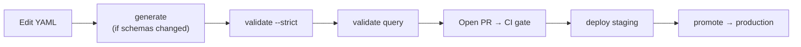

This is the workflow you live in after onboarding: author objects, validate, review, promote, deploy. If you have not built a chain yet, do the [Tutorial](../tutorial.md) first — this page assumes you understand the [object model](../concepts/object-model.md).

## The daily loop



```bash
opentide generate                          # only when schemas/templates changed
opentide validate --strict                 # schema, UUID, uniqueness, chaining
opentide validate query --platform sentinel
opentide deploy --platform sentinel --dry-run
opentide generate docs                          # refresh wiki pages
```

While iterating on a single file, keep the loop tight:

```bash
opentide validate --file objects/rules/my-rule.yaml
```

For large repos, narrow with `--uuid` or `--type` so you validate only what you touched.

## Authoring a good object

Beyond passing validation, good objects are *reviewable* and *chained*.

### Start from a template

New objects should start from the generated templates so required fields and structure are correct:

```bash
cp .opentide/templates/rule.1.0.template.yaml objects/rules/my-rule.yaml
```

### Fill fields with meaning, not placeholders

- **`metadata.schema`** — the correct revision (`rule::1.0`). See [Schema revision](../concepts/schema-revision.md).
- **`metadata.uuid`** — a freshly generated UUID, never copied.
- **`description`** — what the detection catches and why, in a sentence a reviewer can judge.
- **`severity` / `response.alert_severity`** — drawn from the severity [vocabulary](/docs/specifications/specs/vocabularies/catalog/).
- **`techniques` / `att&ck`** — the ATT&CK techniques this addresses; these power coverage reporting.

### Chain it

A rule that references no objective is an [orphan](../concepts/object-model.md#anti-patterns-to-avoid). Point `detection_model` at the objective it implements, and make sure that objective references the threat it covers under `objective.threats`. Verify:

```bash
opentide info
opentide --json info --technique T1059 coverage
```

### Map fields to vocabularies

Fields like `severity`, `impact`, `surface`, `methodology`, and `att&ck` draw their allowed values from published [vocabularies](/docs/specifications/specs/vocabularies/catalog/). (`terrain` is free-form prose, not a vocabulary.) Using a value outside the vocabulary fails validation — check the catalog when unsure.

## Status and deployment strategy

Every rule has a `status`, and each status maps to a **strategy** that drives whether and how the rule deploys. Statuses are configurable; the table below is the bundled set:

| Intent | Bundled statuses | Deploys? |
|--------|------------------|----------|
| Design | `DESIGN` | No (`INERT`) |
| Build & refine | `DEVELOPMENT`, `IMPROVING`, `STAGING`, `ACCEPTANCE` | Staging (`PREVIEW`) |
| Live | `PRODUCTION` | Production (`RELEASE`) |
| Retire | `DISABLED`, `REMOVED` | Disable / delete |

opentide validates only that a rule's `status` exists in your merged `deployment.toml` — it does not enforce any ordering between statuses, so you can set any configured status directly. If you override `deployment.toml`, these names may not exist at all in your repo. See [Configuration → deployment statuses](../configuration.md#deployment-statuses-and-strategies).

## Promotion

Edit the rule's `status` in YAML (and commit it) for deliberate changes, then deploy. When `[promotion]` is enabled in `deployment.toml`, `opentide deploy` rewrites promotable statuses **directly** to the configured `promotion_target` — it does not walk them one step at a time. Statuses whose strategy is `RELEASE`, `DISABLEMENT`, or `DELETION` are left untouched. There is no separate `mutate promote` command.

```bash
# after reviewing and bumping status in YAML
opentide deploy --platform sentinel --dry-run
opentide deploy --platform sentinel
```

See [`deploy`](../../cli/deploy.md) and [Configuration → promotion](../configuration.md#promotion).

## Platform queries

Each rule carries per-platform query blocks under `configurations`. Five platforms support **query syntax validation**; two are deploy-only:

| Platform | Query language | Query validate |
|----------|----------------|:--------------:|
| Sentinel | KQL | yes |
| Defender for Endpoint | KQL | yes |
| Splunk | SPL | yes |
| SentinelOne | S1QL | yes |
| Carbon Black Cloud | Lucene | yes |
| CrowdStrike | — | no (deploy only) |
| HarfangLab | — | no (deploy only) |

Always run `opentide validate query --platform <name>` for supporting platforms before deploy. opentide reports `supported: false` for CrowdStrike/HarfangLab rather than faking a pass — see [Platforms](../concepts/platforms.md).

## Review checklist

Use this in pull-request reviews:

1. Does `validate --strict` pass? (CI enforces it — see [CI/CD](./ci-cd.md).)
2. Is the rule chained to an objective, and the objective to a threat?
3. Are `severity`, `att&ck`, and vocabulary fields meaningful and valid?
4. Is `status` appropriate for the change (not accidentally `PRODUCTION`)?
5. For supported platforms, does query validation pass?
6. Is `metadata.version` bumped if the detection logic changed?

## Exports and coverage

```bash
opentide generate exports navigator
opentide generate exports revisions
opentide --json info --technique T1059 coverage
```

See [`generate exports`](../../cli/generate.md).

## Agent-assisted authoring

Agents can run the same loop through MCP. Configure once:

```bash
opentide setup mcp --cursor --yes
opentide setup skills --yes --generic
```

Then see [Agentic setup](./agentic-setup.md) for a safe agent workflow and its limits.
